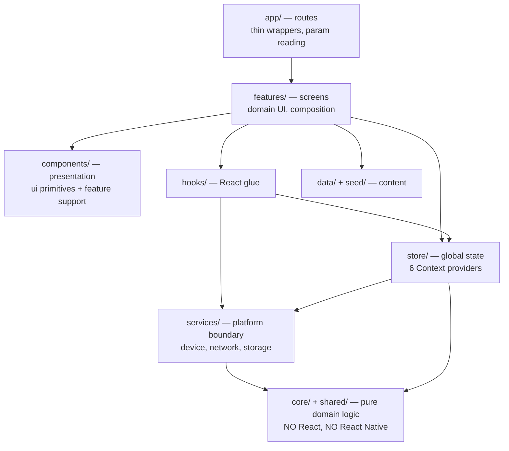
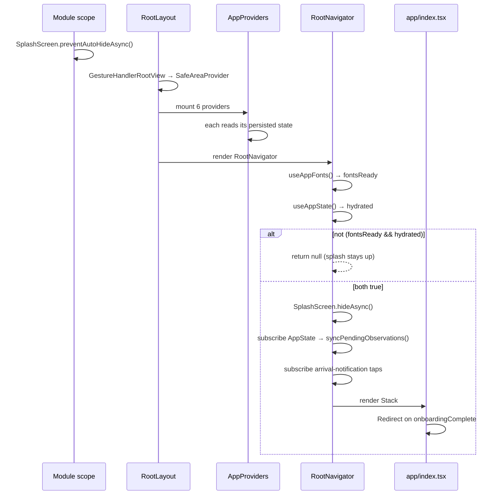
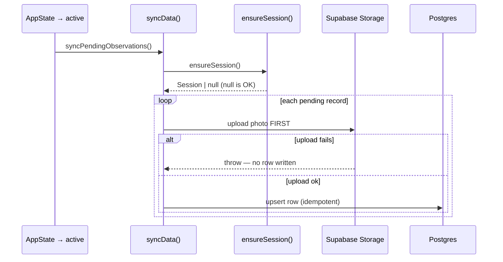
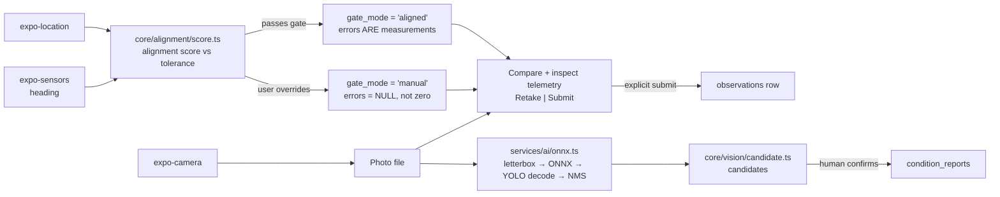
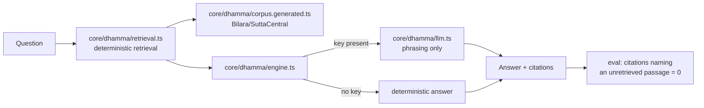

# Architecture

**Audited commit:** `dbe6d45e7297c5d889be9e69c3e2e190a578e6b1` (branch `main`)

---

## 1. Architectural style

**Layered, offline-first, feature-organised.** The defining decisions:

1. **Thin routes, fat features.** Files under `app/` are 3–6 line wrappers; real screens live in `features/`.
2. **A framework-free domain core.** `core/` contains business logic with no React and no React Native imports, tested independently under `node:test`.
3. **Services as the only platform boundary.** Everything touching a device capability or the network goes through `services/`.
4. **The device is the source of truth.** The network is an opportunistic, idempotent copy.
5. **State is React Context, deliberately.** No state library at all.

---

## 2. The layers



**Dependency direction is strictly downward.** `core/` never imports from `services/`, `store/`, `features/`, or `app/`. This is not a convention — it is *enforced by the build*: `core/` and `shared/` are excluded from the app's tsconfig and compiled under a separate, React-free config ([tools/test/tsconfig.json](../../tools/test/tsconfig.json)). A React import in `core/` would break its test run.

| Layer | Directory | Rule |
|---|---|---|
| Routes | [app/](../../app/) | Read params, render a feature screen. No business logic |
| Screens | [features/](../../features/) | Compose components, call hooks/stores/services |
| Presentation | [components/](../../components/) | `ui/` = design system; others = feature support |
| React glue | [hooks/](../../hooks/) | Bridge services/stores into React lifecycles |
| Global state | [store/](../../store/) | 6 Context providers |
| Platform | [services/](../../services/) | The **only** place that touches device APIs or network |
| Domain | [core/](../../core/), [shared/](../../shared/) | Pure functions, fully tested, framework-free |
| Content | [data/](../../data/), [seed/](../../seed/) | Sites, quests, plates, corpus |

---

## 3. Initialisation sequence

Boot order matters and is deliberately gated. From [app/_layout.tsx](../../app/_layout.tsx):



**The gate is the architecture.** `RootNavigator` returns `null` — not a spinner — until fonts and hydration both settle, so the splash screen stays in place rather than showing "a half-styled frame."

The corresponding rule in [app/index.tsx](../../app/index.tsx): `hydrated` is guaranteed true by the time the redirect runs, "so there is no window in which we could redirect on a default value."

**Do not add UI that renders before this gate.**

---

## 4. Provider hierarchy

Composed once in [store/index.tsx](../../store/index.tsx) as `AppProviders`:

```
GestureHandlerRootView → SafeAreaProvider → AppProviders(
  AppStateProvider → PreferencesProvider → PermissionsProvider →
  PracticeProvider → QuestsProvider → ArrivalProvider
) → RootNavigator
```

Rationale in-source: one mounting point "so the root layout composes one element instead of a nesting pyramid that grows with every new provider."

Full state shapes in [STATE_AND_DATA_FLOW.md](STATE_AND_DATA_FLOW.md).

---

## 5. Data architecture — two stores, one direction

### Local (authoritative)

**expo-sqlite**, database `sakshi.db`, managed by [services/database/index.ts](../../services/database/index.ts) (1047 lines) with a hand-rolled migration runner keyed on `PRAGMA user_version`:

```js
const row = await db.getFirstAsync('PRAGMA user_version');
for (let version = current; version < migrations.length; version += 1) {
  await db.execAsync(migrations[version]);
  await db.execAsync(`PRAGMA user_version = ${version + 1}`);
}
```

**8 local migrations (0–7)** creating:

| Table | Purpose |
|---|---|
| `observations` | Captures |
| `condition_reports` | Damage reports |
| `merit_events` | The append-only merit ledger |
| `site_visits` | Visit records |
| `quests` | Quest definitions |
| `quest_progress` | Per-quest progress |
| `quest_completions` | Completion records |
| `quest_submissions` | Task evidence |

> **The rule stated in that file: "Schema changes go through `migrations` below. Never edit an existing entry."** Editing a shipped migration desynchronises devices that already ran it. Always append.

Two migrations carry comments explaining that rows written *before* them "keep a truthful state" / "keep a truthful 'not recorded' state" — the honesty-of-measurement promise applied to schema evolution.

**AsyncStorage** ([services/storage/index.ts](../../services/storage/index.ts)) holds flags, preferences and small JSON maps, keyed by `constants/storage.ts`.

### Remote (a copy)

Supabase Postgres + Storage, 8 SQL migrations, RLS owner-scoped. See [BACKEND_AND_API.md](BACKEND_AND_API.md).

> **Two parallel migration systems exist** — local SQLite (`services/database/index.ts`, versions 0–7) and remote Postgres (`supabase/migrations/0001–0008`). They are **independent** and must be reasoned about separately, though their table names overlap.

---

## 6. Sync flow



**Two invariants:**
1. **Upload before insert, always.** "A failed upload throws here and no row is written" — a row must never reference a missing photo.
2. **`upsert`, never `insert`.** Re-running a failed pass cannot duplicate rows. This is what makes an opportunistic trigger safe.

---

## 7. Capture pipeline

The app's central flow, spanning every layer:



The shutter freezes an immutable draft with the same coordinate, heading and pitch that fed the reticle. [features/sakshi/CaptureScreen.tsx](../../features/sakshi/CaptureScreen.tsx) then shows `ThenNowCompare` plus the attached telemetry. Only `submitDraft()` moves the photograph out of the camera cache and inserts the local `observations` row; retaking does not create a record. The local-first and later-sync ordering is unchanged.

Three promises are enforced structurally here:
- **Never faked**: unmeasured error → `NULL`, never `0`
- **By-eye never dressed as measured**: `gate_mode` distinguishes them, and a SQL `CHECK` constraint refuses an `aligned` claim without measurements
- **AI suggests, never decides**: the detector produces *candidates*; a person confirms before a report exists

---

## 8. Dhamma pipeline



**Retrieval is the ground; the LLM only phrases.** Per [.env.example](../../.env.example): without a key, "Dhamma falls back to deterministic retrieval, which is still grounded and still cited. A missing key degrades an answer, it never fabricates one."

This is verified by `npm run eval:dhamma` — 50/50 including 12 out-of-scope refusals and 6 adversarial prompts, with **zero** ungrounded citations.

---

## 9. Error handling

There is no global error boundary. The patterns actually used:

| Pattern | Where | Meaning |
|---|---|---|
| **Directed throw** | `getSupabase()` | Throws a message telling you what to set. Callers that can work offline check `isConfigured()` first |
| **Null as a working state** | `ensureSession()`, `PracticeProvider.recognise()`, `getQuestById()` | Not a failure — a legitimate degraded outcome the caller must handle |
| **Warn once** | `auth.ts` `reportedUnavailable` | For paths that "run often and quietly" |
| **Swallow** | `syncPendingObservations().catch(() => undefined)` | Background work must not surface transient failures |
| **Swallow by design** | `services/storage` | "The storage layer swallows errors by design — the worst case is a preference that does not survive a restart" |
| **Circuit breaker** | [core/net/breaker.ts](../../core/net/breaker.ts) | Tested; call sites **Needs verification** |
| **Explicit error UI** | [components/common/ErrorState.tsx](../../components/common/ErrorState.tsx), [EmptyState.tsx](../../components/common/EmptyState.tsx), [LoadingState.tsx](../../components/common/LoadingState.tsx), [OfflineBanner.tsx](../../components/common/OfflineBanner.tsx) | Shared state components |
| **Copy for failure** | [core/copy/failure-lines.ts](../../core/copy/failure-lines.ts) | Failure messages are treated as content, not strings |

**`null` is a first-class return value in this codebase.** Do not "fix" it by throwing.

---

## 10. Loading and hydration

Every store exposes `hydrated`, and the app gates on it rather than rendering defaults. The universal write pattern is **state first, persistence second**:

```ts
setPreferences(prev => ({ ...prev, [field]: value }));  // UI moves now
await storage.setUserPreference(field, value);          // disk catches up
```

Rationale: "A switch that waits on AsyncStorage before moving reads as a broken control."

---

## 11. Offline behaviour

Offline is the **assumed** condition, not an edge case — "a phone in the Sacred Garden may have no signal for hours."

| Concern | Mechanism |
|---|---|
| Writes | Always local first (SQLite + file system) |
| Queue | Pending records drained by `syncData()` |
| Trigger | App foreground; also manual via the Sync screen |
| Idempotency | `upsert` |
| Unconfigured backend | `isConfigured()` false → app runs, sync skipped |
| No auth | `ensureSession()` → `null`, still a working state |
| Reachability | [services/net/reachability.ts](../../services/net/reachability.ts) |
| UI signal | [components/common/OfflineBanner.tsx](../../components/common/OfflineBanner.tsx) |
| Offline AI | [services/offlineModel/index.ts](../../services/offlineModel/index.ts) + llama.rn |
| Offline content | Bundled seed data, `.opus` narration, `.onnx` model, all in `assetBundlePatterns` |

---

## 12. Platform-split pattern

Metro resolves platform-specific extensions automatically. Two components use it:

| Native | Web |
|---|---|
| [components/map/MapWebView.tsx](../../components/map/MapWebView.tsx) | [MapWebView.web.tsx](../../components/map/MapWebView.web.tsx) |
| [components/map/SiteMap3D.tsx](../../components/map/SiteMap3D.tsx) | [SiteMap3D.web.tsx](../../components/map/SiteMap3D.web.tsx) |

Import `'./SiteMap3D'` — Metro picks `.web.tsx` on web, `.tsx` elsewhere. The ESLint config's resolver settings exist specifically so lint resolves these the same way the bundler does.

**Add a `.web.tsx` when a component needs a native module the web cannot provide.**

---

## 13. Recurring patterns

| Pattern | Example | Why |
|---|---|---|
| Barrel exports | `components/*/index.ts`, `features/*/index.ts` | Import from the folder, not the file |
| Namespace services | `export * as storage from './storage'` | `services.storage.getBoolean(...)` |
| Context + throw-if-missing | every store | Missing provider = clear error |
| Centralised keys | `constants/storage.ts` | Never inline a storage key |
| Data-driven flows | `features/onboarding/steps.ts` | Reorder in one place |
| Path alias `@/` | everywhere | `@/*` → `./*` |
| Rationale comments | throughout | Explain *why*, often citing a past regression |

---

## 14. Architectural constraints

**Do not violate these without explicit reason:**

1. **Three surfaces only.** Adding a fourth tab contradicts the stated navigation model.
2. **`core/` stays framework-free.** No React imports.
3. **Services own the platform boundary.** Screens must not call `expo-*` device APIs directly.
4. **Never edit a shipped migration** — local or remote. Append.
5. **Upload before insert** in sync.
6. **`upsert`, not `insert`.**
7. **Lazy Supabase client** — never module scope.
8. **`EXPO_PUBLIC_` prefix** on any client-read env var.
9. **Nothing is deleted** — correct by adding a record.
10. **Unmeasured is `NULL`, never `0`.**
11. **AI output is advisory** — never gate a submission on it.
12. **Storage keys live in `constants/storage.ts`** (with `deviceId`'s deliberate lack of a version prefix preserved).

---

## Needs verification

1. Call sites of the circuit breaker.
2. Exact column definitions of the 8 local SQLite tables (only names captured).
3. Whether any screen bypasses `services/` to call an `expo-*` API directly.
4. Relationship between `services/sync/index.ts` and `services/supabase/sync.ts`.

---

*Part of the [docs/ai-context](README.md) knowledge base. Snapshot of commit `dbe6d45e`; verify against current source before relying on details.*
