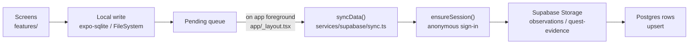

# Backend and API

**Audited commit:** `dbe6d45e7297c5d889be9e69c3e2e190a578e6b1` (branch `main`)
**Backend provider:** Supabase (`@supabase/supabase-js` ^2.109.0)

---

## 1. Architecture at a glance

The app is **offline-first**. Nothing blocks on the network. Captures are written locally, then pushed to Supabase in a later sync pass.



**Critical ordering rule** — from [services/supabase/sync.ts](../../services/supabase/sync.ts): the photo upload happens **"always before the row insert, never after: a failed upload throws here and no row is written."** A row must never reference a photo that does not exist. Preserve this ordering.

---

## 2. Supabase client — [services/supabase/index.ts](../../services/supabase/index.ts)

The client is constructed **lazily**, and the source is emphatic that this is load-bearing, not stylistic:

> "`createClient` throws synchronously when the URL is missing, so building it at module scope meant a clone without `.env.local` crashed the moment anything imported it — and since it was re-exported through `utils/`, that was every screen in the app, before a single frame rendered."

**Do not move client construction to module scope.** That is a regression this code exists to prevent.

| Export | Signature | Behaviour |
|---|---|---|
| `isConfigured()` | `(): boolean` | True only when both env vars are set **and** are not the `.env.example` placeholders (`your-project.supabase.co`, `your-publishable-key`) |
| `getSupabase()` | `(): SupabaseClient` | Returns the memoised client; **throws a directed error** when unconfigured |

> Callers that can work offline must check `isConfigured()` first rather than catching the throw.

Client auth options: session storage is `AsyncStorage` (React Native has no `localStorage`), `autoRefreshToken: true`, `persistSession: true`, `detectSessionInUrl: false`.

**Env vars:** `EXPO_PUBLIC_SUPABASE_URL`, `EXPO_PUBLIC_SUPABASE_KEY`. Both are `EXPO_PUBLIC_`-prefixed, therefore inlined into the bundle and readable by anyone with the app. The key is the **publishable (anon)** key, which is designed for that. See [CONFIGURATION_AND_ENVIRONMENT.md](CONFIGURATION_AND_ENVIRONMENT.md).

---

## 3. Authentication — [services/supabase/auth.ts](../../services/supabase/auth.ts)

**Anonymous sessions only.** There is no sign-up form, no login screen, no password. The design intent, in the source's words:

> "Someone standing at the Maya Devi temple with a photograph to record should not first meet a sign-up form; the account exists to own rows, not to identify a person."

### Why a session exists at all

Before auth, every row arrived as the `anon` role, so RLS "could only ask *what* was writing, never *who*" — `anon` held update on every row, and a leaked publishable key could overwrite anyone's observation. `device_id` did not close that gap: it is a client-supplied value, and "a policy resting on it would be theatre."

`auth.uid()` comes from a signed token the client cannot forge, so `user_id = auth.uid()` is checkable by the database.

| Export | Signature | Behaviour |
|---|---|---|
| `ensureSession()` | `(): Promise<Session \| null>` | Returns existing session, else signs in anonymously. **Returns `null` rather than throwing** when a session can't be had |
| `getUserId()` | `(): Promise<string \| null>` | The signed-in user id, read from the session |
| `resetSessionCache()` | `(): void` | Drops the cached promise. For sign-out and tests. **Does not end the session** |

**`null` is a working state, not a failure.** The most common cause is anonymous sign-ins being switched off in the Supabase dashboard (Authentication → Sign In / Providers) — not something the app can fix at runtime. It warns once, not on every sync pass.

**Authorship is never client-asserted.** `user_id` is filled by a **column default of `auth.uid()`** — "nothing in the app needs to state its own authorship, and nothing in the app is trusted to."

**Promise-caching detail:** a rejected `pending` promise is explicitly cleared so "a pass that failed on a dead network must be free to succeed on the next one." Keep that `.catch` if you refactor.

### Known limitation (stated in-source)

An anonymous session lives in this app's storage, so **a reinstall is a new account** and old records stay behind under an id nobody holds. Surviving a reinstall needs a real credential; the intended path is Supabase's upgrade-anonymous-user-in-place by adding an email, "not a second account system."

### ⚠️ Migration 0007 ordering hazard

[services/supabase/auth.ts](../../services/supabase/auth.ts) states:

> "Migration 0006 deliberately left the `anon` write policies in place, so an unauthenticated device still syncs. … **Migration 0007 removes that fallback, and must not be applied until both have happened**" (clients updated **and** anonymous sign-in enabled).

[supabase/migrations/0007_retire_anonymous_writes.sql](../../supabase/migrations/0007_retire_anonymous_writes.sql) **exists in the repo**. Whether it has been applied to the live project cannot be determined from source. If it has been applied while anonymous sign-in is disabled, **all writes from all devices fail**. Flagged in [KNOWN_ISSUES_AND_TECHNICAL_DEBT.md](KNOWN_ISSUES_AND_TECHNICAL_DEBT.md). **Needs verification against the live Supabase project.**

---

## 4. Database schema

Source of truth: [supabase/migrations/](../../supabase/migrations/) — 8 migrations. This is **not inferred**; it is read directly from DDL.

### `public.observations` — [0001](../../supabase/migrations/0001_observation_sync.sql), extended by [0002](../../supabase/migrations/0002_capture_integrity.sql), [0003](../../supabase/migrations/0003_by_eye_captures.sql), [0004](../../supabase/migrations/0004_device_identity.sql), [0006](../../supabase/migrations/0006_author_identity.sql)

| Column | Type | Null | Meaning |
|---|---|---|---|
| `id` | `text` | PK | Client-generated id |
| `vantage_id` | `text` | not null | Fixed viewpoint |
| `site_id` | `text` | not null | Heritage site |
| `captured_at` | `timestamptz` | not null | Capture time |
| `photo_path` | `text` | not null | Path in `observations` bucket |
| `latitude` / `longitude` | `double precision` | not null | Observer position |
| `bearing` / `pitch` | `double precision` | not null | Device orientation |
| `position_error_m` | `double precision` | **nullable since 0003** | Metres between observer and vantage. **Null = not measured (by-eye capture), never zero error** |
| `bearing_error_deg` | `double precision` | **nullable since 0003** | Degrees off target bearing. **Null = not measured, never zero error** |
| `note` | `text` | nullable | Free text |
| `assessment` | `text` | default `'unreviewed'` | Review state |
| `received_at` | `timestamptz` | default `now()` | Server receipt |
| `gate_mode` | `text` | nullable (0002) | `aligned` = tolerance gate passed, errors are measurements; `manual` = framed by eye; `null` = predates this recording |
| `align_score` | `double precision` | nullable (0002) | Weighted alignment score. **Meaningful only where `gate_mode = 'aligned'`** |
| `gps_acc_m` | `double precision` | nullable (0002) | GPS accuracy in metres. "`position_error_m` cannot be interpreted without it" |
| `device_id` | `text` | nullable (0004) | Opaque per-install id. **Not a person, not authenticated, not stable across reinstall** |
| `user_id` | `uuid` | nullable (0006) | FK `auth.users(id)` ON DELETE SET NULL, **DEFAULT `auth.uid()`** |

**Constraint `observations_aligned_is_measured`** (0003):
```sql
check (gate_mode is distinct from 'aligned'
       or (position_error_m is not null and bearing_error_deg is not null))
```
Its own comment: "`gate_mode = aligned` asserts the errors are measurements; this refuses the assertion without them." **This is a data-integrity guarantee about evidence quality — do not weaken it.**

Indexes: `(site_id, captured_at desc)`, `(vantage_id, captured_at desc)`, `(gate_mode) where not null`, `(device_id, captured_at desc) where not null`, `(user_id, captured_at desc) where not null`.

### `public.condition_reports` — [0001](../../supabase/migrations/0001_observation_sync.sql), + [0004](../../supabase/migrations/0004_device_identity.sql), [0006](../../supabase/migrations/0006_author_identity.sql)

| Column | Type | Null | Meaning |
|---|---|---|---|
| `id` | `text` | PK | |
| `observation_id` | `text` | not null | FK → `observations(id)` **ON DELETE CASCADE** |
| `site_id` | `text` | not null | |
| `category` / `subtype` / `severity` | `text` | not null | Damage classification |
| `note` | `text` | nullable | |
| `recorded_at` | `timestamptz` | not null | |
| `received_at` | `timestamptz` | default `now()` | |
| `device_id` | `text` | nullable (0004) | Matches `observations.device_id` |
| `user_id` | `uuid` | nullable (0006) | DEFAULT `auth.uid()` |

Indexes: `(site_id, recorded_at desc)`, `(device_id, recorded_at desc) where not null`.

### `public.quest_submissions` — [0005](../../supabase/migrations/0005_quest_evidence.sql), + [0006](../../supabase/migrations/0006_author_identity.sql)

Composite PK: **`(device_id, quest_id, task_id)`**.

| Column | Type | Meaning |
|---|---|---|
| `device_id`, `quest_id`, `task_id` | `text` | Composite primary key |
| `photo_path` | `text` nullable | Path in `quest-evidence` bucket |
| `count` | `integer` nullable | For counting tasks |
| `note` | `text` nullable | |
| `submitted_at` | `timestamptz` not null | |
| `review_verdict` | `text` nullable | **Advisory AI opinion**: `looks-right \| looks-wrong \| unsure \| unavailable`. Null = not reviewed |
| `review_comment` | `text` nullable | |
| `review_model` | `text` nullable | Which model gave the verdict |
| `reviewed_at` | `timestamptz` nullable | |
| `received_at` | `timestamptz` default `now()` | |
| `user_id` | `uuid` nullable | DEFAULT `auth.uid()` |

Table comment: *"What someone brought back from a quest task. Record-class: the photograph is evidence, the tick is not."*

**The AI verdict is explicitly advisory** — its comment says it is "Never a finding, never gated submission." `review_model` is "Required to read `review_verdict` as an opinion rather than an assessment." **Do not make submission conditional on the verdict.**

### `public.profiles` — [0008](../../supabase/migrations/0008_leaderboard.sql)

| Column | Type | Meaning |
|---|---|---|
| `device_id` | `text` PK | Keyed by device |
| `user_id` | `uuid` | FK `auth.users`, DEFAULT `auth.uid()` |
| `handle` | `text` not null | `check (length(trim(handle)) between 1 and 32)` |
| `created_at` / `updated_at` | `timestamptz` | default `now()` |

Table comment: *"Handles are spoofable while anon writes are permitted — scores are not."*

### `public.leaderboard` — VIEW, [0008](../../supabase/migrations/0008_leaderboard.sql)

Not a table. Aggregates contribution points from the three write tables:

| Source | Points each |
|---|---|
| `observations` | 50 |
| `condition_reports` | 25 |
| `quest_submissions` | 30 |

**Daily cap of 200 points** applied per device per UTC day (`least(sum(points), 200)`), mirroring the cap in [shared/merit.ts](../../shared/merit.ts).

Columns: `device_id`, `handle` (fallback `'Unnamed guardian'`), `points`, `points_7d`, `active_days`, `last_active`.

Its comment states the privacy contract: *"Exposes handle, points and a day count only — never observations, coordinates, photographs or which sites anyone visited. SECURITY DEFINER is deliberate."*

**If you change point values or the cap, change [shared/merit.ts](../../shared/merit.ts) and this view together** or client and server totals diverge.

---

## 5. Row Level Security

RLS is enabled on `observations`, `condition_reports`, `quest_submissions`, `profiles`.

### Policy evolution

| Migration | Change |
|---|---|
| 0001, 0005 | `anon` INSERT/UPDATE with `check (true)` on all write tables + storage buckets |
| 0006 | Adds `authenticated` owner policies: INSERT/UPDATE/SELECT gated on `user_id = auth.uid()` |
| **0007** | **Drops every `anon` write policy** (tables and storage) |
| 0008 | `profiles`: both anon and owner write policies; **SELECT open to `anon, authenticated` (`using (true)`)** |

**Post-0007 the security model is:** authenticated (anonymous-session) users may write and read **only their own rows**. There is no policy granting broad SELECT on `observations`, `condition_reports`, or `quest_submissions` — the leaderboard view is the only public read surface, and it is deliberately aggregate-only.

> `profiles` retains its `anon` write policies even after 0007 (0008 runs later and re-creates them). Whether that is intentional is **Needs verification**.

---

## 6. Storage buckets

| Bucket | Public | Created in | Holds |
|---|---|---|---|
| `observations` | **false** | [0001](../../supabase/migrations/0001_observation_sync.sql) | Capture photographs |
| `quest-evidence` | **false** | [0005](../../supabase/migrations/0005_quest_evidence.sql) | Quest task photographs |

Both private. Storage policies follow the same anon→authenticated evolution as the tables.

---

## 7. Sync operations — [services/supabase/sync.ts](../../services/supabase/sync.ts)

| Operation | Function | Target | Notes |
|---|---|---|---|
| Upload photo | `uploadPhoto(bucket, path, uri)` (private) | Storage bucket | Reads file, `decode()` via `base64-arraybuffer`, uploads. **Runs before any row write** |
| Sync all | `syncData()` | — | Entry point; walks pending observations, condition reports, quest submissions |
| Observations | inside `syncData` | `.from('observations').upsert(...)` | Photo → `observations` bucket first |
| Condition reports | inside `syncData` | `.from('condition_reports').upsert(...)` | |
| Quest submissions | inside `syncData` | `.from('quest_submissions').upsert(...)` | Photo → `quest-evidence` bucket first |

**`upsert`, not `insert`** — sync is idempotent, so a retried pass does not duplicate rows. This is what makes the offline queue safe to re-run.

A source comment near the quest-evidence path notes that a filename can be "unique on one phone but not across a shared bucket" — path construction matters for collision safety.

**Trigger:** `syncPendingObservations()` is called from [app/_layout.tsx](../../app/_layout.tsx) on every `AppState` → `active` transition, errors swallowed. Also exposed through [features/settings/SyncScreen.tsx](../../features/settings/SyncScreen.tsx).

> The root layout imports `syncPendingObservations` from `@/services/sync` while the upsert logic above lives in `services/supabase/sync.ts`. The relationship between [services/sync/index.ts](../../services/sync/index.ts) and [services/supabase/sync.ts](../../services/supabase/sync.ts) is **Needs verification** — likely a wrapper, but not confirmed.

---

## 8. Optional LLM integration

Configured by four env vars, **all optional**:

| Var | Purpose | Default in `.env.example` |
|---|---|---|
| `EXPO_PUBLIC_LLM_API_KEY` | Auth for the LLM provider | *(empty)* |
| `EXPO_PUBLIC_LLM_ENDPOINT` | Chat-completions URL | `https://ollama.com/v1/chat/completions` |
| `EXPO_PUBLIC_VISION_MODEL` | Quest photo review | `gemma4:31b` |
| `EXPO_PUBLIC_DHAMMA_MODEL` | Dhamma answers / reflections | `gpt-oss:120b-cloud` |

[.env.example](../../.env.example) states the degradation contract precisely:

> "Absent is a supported state everywhere. Quest review reports 'unavailable'; Dhamma falls back to deterministic retrieval, which is still grounded and still cited. **A missing key degrades an answer, it never fabricates one.**"

**The `EXPO_PUBLIC_` prefix is load-bearing.** A recorded bug in that file: `core/dhamma` previously read `OLLAMA_API_KEY` with no prefix, "which Expo does not inline — so it was undefined on every device and the provider was never called at all." Any new client-read env var **must** carry the prefix.

Relevant modules: [core/dhamma/llm.ts](../../core/dhamma/llm.ts), [core/dhamma/engine.ts](../../core/dhamma/engine.ts), [core/dhamma/retrieval.ts](../../core/dhamma/retrieval.ts), [services/dhamma/index.ts](../../services/dhamma/index.ts), [services/questReview/index.ts](../../services/questReview/index.ts).

**Needs verification:** the exact fallback code path in `core/dhamma/engine.ts` when the key is absent, and how `core/dhamma/corpus.generated.ts` is produced (likely [tools/fetch-bilara.mjs](../../tools/fetch-bilara.mjs) — the `corpus:fetch` script — from the Bilara/SuttaCentral corpus).

---

## 9. Mock API

[mock-api/server.mjs](../../mock-api/server.mjs) is a zero-dependency Node server run via `npm run api`. Per [.env.example](../../.env.example) it "serves the site/quest/merit contract offline," configured by `EXPO_PUBLIC_API_URL` (default `http://192.168.1.10:8000`) and `PORT` (default 8000).

> **Device gotcha, called out in `.env.example`:** point the phone at this machine's **LAN IP**, "NOT localhost, which on the phone means the phone."

Deployment config exists at [mock-api/railway.json](../../mock-api/railway.json) and a root [Procfile](../../Procfile).

**Needs verification:** the exact route list, and whether any running app code actually reads `EXPO_PUBLIC_API_URL` (no importer was confirmed during this audit — it may be documentation-only or consumed by a path not yet traced).

---

## 10. Feature status verdicts

| Capability | Status | Evidence |
|---|---|---|
| Observation sync (photo + row) | **Fully implemented** | `syncData()` uploads then upserts; schema, RLS, bucket all present |
| Condition reports | **Fully implemented** | Table + FK cascade + upsert path in `sync.ts` |
| Quest evidence submission | **Fully implemented** | Table, bucket, upsert path all present |
| Anonymous auth | **Fully implemented** | `ensureSession()` complete with degraded-null path |
| Leaderboard | **Fully implemented (server side)** | View defined in 0008 with cap + privacy contract; client read path in [services/leaderboard/index.ts](../../services/leaderboard/index.ts) **not yet traced** |
| Dhamma LLM synthesis | **Partially implemented / optional by design** | Key-absent fallback is documented as supported; code path **Needs verification** |
| AI quest photo review | **Partially implemented — advisory only** | Schema columns exist and are documented as never gating submission |
| Offline-first local write | **Fully implemented** | Pending queue + idempotent upsert + foreground trigger |
| Mock API wiring | **Needs verification** | Server exists; no confirmed client importer of `EXPO_PUBLIC_API_URL` |

---

## Needs verification

1. Whether migration 0007 has been applied to the live project, and whether anonymous sign-in is enabled there.
2. Relationship between [services/sync/index.ts](../../services/sync/index.ts) and [services/supabase/sync.ts](../../services/supabase/sync.ts).
3. Local SQLite schema in [services/database/index.ts](../../services/database/index.ts).
4. Client read path for the leaderboard view.
5. Whether `EXPO_PUBLIC_API_URL` / the mock API is wired into any live code path.
6. Dhamma engine fallback branch and corpus generation pipeline.
7. Circuit-breaker usage — [core/net/breaker.ts](../../core/net/breaker.ts) and [services/net/reachability.ts](../../services/net/reachability.ts) exist but their call sites were not traced.
8. `profiles` retaining `anon` write policies post-0007 — intentional or oversight.

---

*Part of the [docs/ai-context](README.md) knowledge base. Snapshot of commit `dbe6d45e`; verify against current source before relying on details.*
