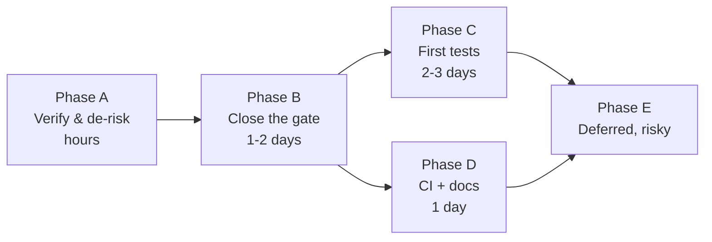

# Current Implementation Plan and Project Status

**Audited commit:** `dbe6d45e7297c5d889be9e69c3e2e190a578e6b1` (branch `main`)
**Commit date:** 2026-08-10 · **Audited:** 2026-08-25

> **Section 1–3 are verified findings.** **Section 4 onward is `Suggested`** — my recommendations, not confirmed project requirements. Nobody on the team has asked for them.

---

## 1. Verified state

### Working tree
```
On branch main. Up to date with origin/main.
Untracked: docs/ai-context/   (this knowledge base)
```
**No modified source files. No work in progress in the tree.** The last commit is 15 days before this audit.

### Quality gates — actually run

| Gate | Result |
|---|---|
| `npm install` | ✅ 934 packages, patch applied |
| `npm run typecheck` | ✅ Clean |
| `npm test` | ✅ **126/126** |
| `npm run validate` | ✅ Pass, **5 warnings** |
| `npm run vocab` | ✅ Clean |
| `npm run eval:dhamma` | ✅ **50/50**, 0 ungrounded citations |
| `npm run verify` | ✅ Pass |
| `npm run lint` | ❌ **16 errors** (one file) |
| `npx expo start --web` | ✅ Bundles and serves |

### Content
12 sites · 6 vantages · 10 quests · 3 needs · 5 timeline entries · 10 plates · 12 narration files

---

## 2. Verified prior plans

[PROJECT.md](../../PROJECT.md) records three completed milestones:

| Milestone | Scope | Status |
|---|---|---|
| **M1 — Phase 9: Quests** | SQLite migrations, types, `QuestsProvider`, seed data, quest UI, routes | **DONE** |
| **M2 — Phase 11: Settings** | Preference storage, 6 settings screens, stack routes, header entry | **DONE** |
| **M3 — Phase 12: Polish & QA** | `OfflineBanner`, camera loading/error handling, edge states, dark theme | **DONE** |

**All three verified as present in the code.**

> ⚠️ `PROJECT.md` is **stale in its details** — it names `hooks/useUserPreferences.ts` (does not exist) and five screen names that no longer match. The milestones are real; the file references are not.

There is also [HANDOFF-PHASE-8-9.md](../../HANDOFF-PHASE-8-9.md) and a `deck/` directory (demo script, QA prep, limitations, rehearsal checklist) indicating **preparation for a hackathon demo**.

---

## 3. What is implemented

### Fully implemented (18 of 21 features)
Onboarding · capture · alignment gate · condition reporting · damage detection · map · site detail + narration · Then/Now · Dhamma Q&A · reflection · quests · merit ledger · leaderboard (live Supabase) · Chaityāvalī register · arrivals · offline sync · settings (8 screens) · demo walk

### Partial or unverified
| Feature | Note |
|---|---|
| AI quest review | **Partial by design** — advisory, optional LLM |
| Dhamma LLM synthesis | **Optional by design** — deterministic fallback verified |
| Offline on-device LLM | ❓ No bundled model; acquisition path untraced |
| Arrivals in background | ❓ No background-location permission declared |

### Not implemented
- Any test for the React layer
- CI/CD
- User accounts beyond anonymous sessions
- iOS verification

### Dead code
- `data/demo/sites.ts` — **an active silent-failure trap**
- `features/practice/` — barrel with no screen
- `core/net/breaker.ts` — ❓ no consumer traced

---

## 4. Blocking issues *(Suggested priority)*

### Blocks a production release

**B1 — Supabase operational state unverified** ([KNOWN_ISSUES](KNOWN_ISSUES_AND_TECHNICAL_DEBT.md) C1)
Migration 0007 drops all anon write policies. If applied while anonymous sign-in is disabled, **every write from every device fails silently**. Cannot be determined from source.
→ *Check the dashboard. Zero code risk. Do this first.*

**B2 — 5 sites with unverified coordinates**
`puskarini`, `marker-stone`, `vihara-remains`, `tilaurakot`, `ramagrama`. Against an 80 m visit radius, a wrong coordinate silently denies or misplaces visit credit.

**B3 — 16 lint errors**
All in `SpeechCloud.tsx`. Blocks a clean gate; `lint` is not in `verify`, which masks it.

### Blocks confident iteration

**B4 — Zero React-layer tests**
The capture → sync pipeline, the boot gate, and all shared UI are unverified by anything but hand testing.

**B5 — `core/` is not type-checked by `verify`**
A type error in the domain layer passes the project's own gate.

---

## 5. High-risk areas *(Suggested)*

| Area | Why |
|---|---|
| `app/_layout.tsx` boot gate | White screen at launch if broken. Untested |
| `services/supabase/index.ts` lazy client | Module-scope construction crashes every screen without `.env.local` |
| ONNX patch + plugin | Removing either breaks the detector **on EAS but not locally** |
| `CaptureScreen` | Core loop; uses deprecated `expo-file-system/legacy` |
| Merit points duplicated in TS + SQL | Silent divergence |
| `data/demo/sites.ts` | Wrong ids resolve to nothing, silently |

---

## 6. Recommended next tasks *(Suggested — my recommendations only)*

### Phase A — Verify and de-risk (hours, near-zero risk)

| # | Task | Validation |
|---|---|---|
| A1 | Confirm Supabase: which migrations applied, anonymous sign-in enabled | Capture on a fresh install → row appears |
| A2 | Delete `data/demo/sites.ts` (nothing imports it — verified) | `npm run verify` |
| A3 | Run `npm audit`, triage the 22 vulnerabilities. **Do not `--force`** | — |
| A4 | Verify arrivals with the app backgrounded on a real device | Walk/simulate a precinct |

**Dependencies:** none. All independent.

### Phase B — Close the quality gate (1–2 days)

| # | Task | Depends on |
|---|---|---|
| B1 | Fix the 16 `SpeechCloud.tsx` errors — migrate to Reanimated | — |
| B2 | Add `lint` to `npm run verify` | B1 |
| B3 | Add a `typecheck:core` script using `tools/tsconfig.test.json`; add to `verify` | — |
| B4 | Resolve the 5 coordinate warnings against OSM/Wikidata | A1 (dashboard access unrelated, can parallel) |

**Validation:** `npm run verify` green **including** lint and core typecheck; `npm run validate` shows 0 warnings.

### Phase C — First tests (2–3 days)

| # | Task | Rationale |
|---|---|---|
| C1 | Test provider composition + boot gate | Highest blast radius, currently untested |
| C2 | Test `isConfigured()` rejects placeholder values | Cheap, guards a documented past regression |
| C3 | Test the sync ordering invariant (upload before insert) | Protects evidence integrity |
| C4 | Decide the harness: revive Vitest in `tools/test/`, or extend `run-tests.mjs` | Blocks C1–C3 |

**C4 first** — it determines how the others are written.

### Phase D — Infrastructure (1 day)

| # | Task |
|---|---|
| D1 | Add CI running `npm run verify && npm run lint` |
| D2 | Update or deprecate `PROJECT.md`; point at `docs/ai-context/` |
| D3 | Triage the ~700 KB of root markdown — verify or mark outdated |

**D1 depends on Phase B** (otherwise CI is red on arrival).

### Phase E — Deferred, higher risk

| # | Task | Risk |
|---|---|---|
| E1 | Migrate off `expo-file-system/legacy` | **High** — evidence path; a mistake loses captures |
| E2 | Expo 57.0.11 → 57.0.16 + `expo install --check` | Medium — rebuild and retest map + detector |
| E3 | Anonymous → upgradeable account (add email in place) | Medium — addresses the reinstall limitation |
| E4 | Verify / produce an iOS build | Unknown |

---

## 7. Suggested order



**Rationale:** A is nearly free and removes an unknown that could invalidate everything downstream. B makes the gate trustworthy, which C and D both depend on. E is deliberately last — it touches the evidence path and native modules, and should only be attempted once tests exist to catch a regression.

---

## 8. What NOT to do *(Suggested)*

- ❌ Add a fourth tab — the three-surface model is a stated design constraint
- ❌ Weaken the five promises to simplify code
- ❌ `npm audit fix --force` — breaks SDK alignment
- ❌ Remove the ONNX patch or plugin
- ❌ Edit any applied migration
- ❌ Hand-edit `data/generated/*`
- ❌ Refactor broadly before Phase C — there are no tests to catch a regression

---

## 9. Honest assessment

This is a **hackathon MVP with production-grade discipline in its domain layer and notable gaps in its verification of the UI layer.**

**Genuinely strong:** database-level integrity constraints enforcing product promises; an anti-hallucination gate for the AI; a content-quality linter; 126 domain tests; in-code comments that explain *why*, repeatedly citing regressions the code prevents. That last quality made this audit substantially easier and is worth preserving.

**Genuinely weak:** the entire React layer is untested; `lint` is excluded from the project's own gate, which masks 16 real errors; and one piece of dead code (`data/demo/sites.ts`) is an active trap that fails silently.

**Most urgent single action:** verify the live Supabase auth/migration state (Phase A1). It is a dashboard check with no code risk, and if it is wrong, every write in production is failing silently right now.

---

*Part of the [docs/ai-context](README.md) knowledge base. Snapshot of commit `dbe6d45e`; §4 onward are `Suggested` recommendations, not confirmed requirements.*
