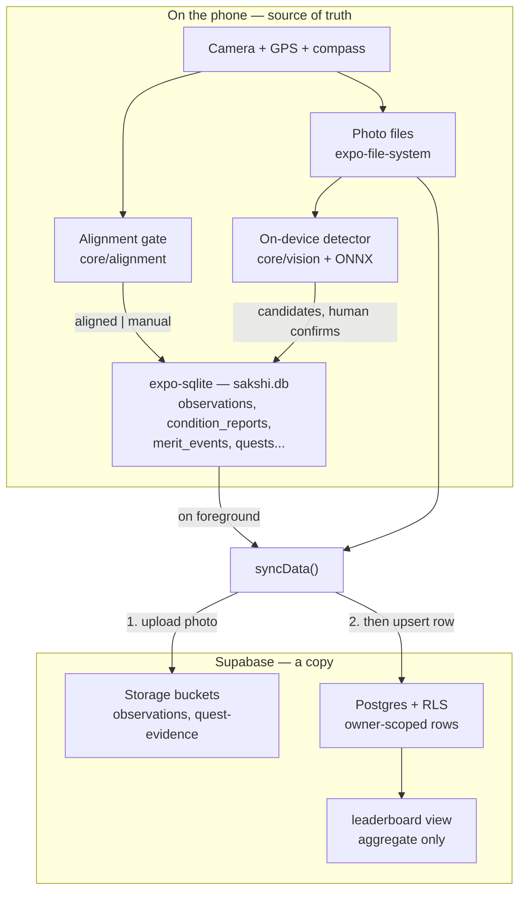

# Project Overview

**Audited commit:** `dbe6d45e7297c5d889be9e69c3e2e190a578e6b1` (branch `main`)

---

## 1. What this is

**Sākṣī** (साक्षी) is a heritage and pilgrimage mobile app for **Lumbini, Nepal** — the birthplace of the Buddha. Built for the **LumbiniX 2026 hackathon** by the LumbiniX-Committee team.

The name means *witness*: someone who sees a thing directly and can speak to it.

The project's own one-line statement of purpose ([README.md](../../README.md)):

> **It turns a visitor's attention into evidence a conservator can trust.**

### The core loop

You go to a heritage site, stand at a **fixed viewpoint** (a "vantage"), line your phone up with it, and photograph what the place looks like today. Come back next month or next year, take the photo again from the same spot, and the two images line up. Over time they become a record of how a place is changing — **made by the people standing in front of it**.

Everything else in the app — the map, the history, the AI, the guided visits — "exists to help you make, understand, or care about that one thing: a photo taken from a known spot on a known day."

### Identity strings

From [constants/app.ts](../../constants/app.ts):

| Constant | Value |
|---|---|
| `APP_NAME` | Sākṣī |
| `APP_SUBTITLE` | the witness |
| `APP_EPIGRAPH` | *appamādena sampādetha* — Dhammapada 20.21, "strive on with diligence" |

Package name / bundle id: `org.lumbinix.sakshi`. Expo slug: `sakshi`. Scheme: `sakshi`.

---

## 2. Target users

Inferred from the code and content — **not** from a stated user-research document:

| User | What they get |
|---|---|
| **Pilgrims and visitors** to Lumbini | Guided exploration, site history, narration, Buddhist Q&A, quests |
| **Conservators / heritage professionals** | A time series of photographs from fixed viewpoints, plus structured condition reports |
| **Local guardians / repeat contributors** | A merit ledger and leaderboard recognising sustained contribution |

The two audiences are served by the same act: a visitor's photograph is the conservator's evidence.

---

## 3. The three surfaces

The app has **exactly three places you can go**. Per [README.md](../../README.md), "They are the idea of the product, not just tabs. There is no Home, Explore, Profile, or Rewards."

| Surface | Name means | What you do there |
|---|---|---|
| **Tīrtha** | a sacred place | Explore Lumbini on a map, read about each site, fade between an old photo and a new one |
| **Sākṣī** | witness | **The main loop** — pick a viewpoint, line up your phone, take the photo, note the condition |
| **Dhamma** | the teaching | Ask about Buddhist texts, get answers backed by real sources, or an honest "I cannot answer that" |

Settings and the Chaityāvalī register exist as stacks reachable from these three — deliberately **not** as a fourth tab. See [SCREENS_AND_NAVIGATION.md](SCREENS_AND_NAVIGATION.md).

[constants/app.ts](../../constants/app.ts) records why there is no fourth "AI" surface:

> "Synthesis by a language model is how Dhamma answers a question that retrieval alone cannot phrase — a capability of that surface, not a place of its own. A tab for it split one idea across two entries in the bar and, as shipped, rendered the identical screen twice."

---

## 4. The five promises

These are the project's stated invariants ([README.md](../../README.md)). They "shape almost every decision in the code" and are "kept honest by automated checks, not just good intentions."

**Any change that violates one of these is a defect, regardless of whether tests pass.**

1. **A measurement is never faked.** If GPS did not get a fix, the app saves "unknown", never zero — "because zero would look like a perfect reading."
   → Enforced in the database: `position_error_m` / `bearing_error_deg` are nullable, and their column comments say "Null means not measured … **never zero error**" ([0003](../../supabase/migrations/0003_by_eye_captures.sql)).

2. **"By eye" is never dressed up as "measured."** A shot lined up by eye is recorded as such and looks different on screen.
   → Enforced by the SQL constraint `observations_aligned_is_measured`: `gate_mode = 'aligned'` is refused unless both error measurements are present.

3. **The AI suggests, it never decides.** The damage detector offers candidates for a person to confirm. Dhamma answers only from real sources and refuses when it cannot back an answer up.
   → Enforced by `quest_submissions.review_verdict` being documented as "Never a finding, never gated submission," and by `npm run eval:dhamma` verifying **"Citations naming an unretrieved passage: 0."**

4. **Nothing is ever deleted.** "A photo is evidence. You fix a mistake by adding a new record, not by erasing the old one."
   → Reflected in the append-only merit ledger and `upsert`-based sync.

5. **The phone is the source of truth.** "A phone in the Sacred Garden may have no signal for hours, so every record is saved on the device first. The cloud is a copy."
   → Enforced by the offline-first architecture: SQLite write → pending queue → sync on foreground.

---

## 5. Technology stack

| Layer | Choice | Version |
|---|---|---|
| Framework | React Native | 0.86.2 |
| Platform | Expo SDK (managed) | 57 |
| UI runtime | React | 19.2.3 |
| Language | TypeScript (`strict: true`) | ~6.0.3 |
| Navigation | expo-router (file-based, typed routes) | ~57.0.11 |
| State | **React Context only** — no Redux/Zustand/React Query | — |
| Local DB | expo-sqlite (`sakshi.db`, WAL) | ~57.0.1 |
| Local KV | AsyncStorage | 2.2.0 |
| Backend | Supabase (Postgres + Storage + anonymous Auth) | ^2.109.0 |
| Maps | MapLibre React Native | ^11.3.6 |
| On-device vision | onnxruntime-react-native + `crack-seg.onnx` | ^1.24.3 |
| On-device LLM | llama.rn | ^0.12.6 |
| Animation | Reanimated 4 + worklets | 4.5.1 |
| Package manager | npm (lockfileVersion 3) | — |

**No native `android/` or `ios/` directories** — this is a fully managed Expo workflow; native projects are generated at build time by config plugins.

---

## 6. Supported platforms

| Platform | Support |
|---|---|
| **Android** | Primary target. Adaptive icon, 3 permissions declared, APK (preview) / AAB (production) via EAS |
| **iOS** | Configured (`supportsTablet: true`, bundle id set) — **no evidence in-repo that an iOS build has been run**. Submit config is Android-only |
| **Web** | Runs (verified: Metro serves, bundle compiles). Partial by nature — platform-split `.web.tsx` files substitute for the map |

Per [README.md](../../README.md): camera, GPS and compass need a **real phone**; the map and damage detector need a **full build**, not Expo Go.

---

## 7. Major capabilities

| Capability | Where |
|---|---|
| Fixed-viewpoint photographic capture with alignment gating | `features/sakshi/`, `core/alignment/` |
| Then/Now historical comparison | `features/tirtha/ThenNowScreen.tsx`, `assets/plates/` |
| On-device damage/crack detection (YOLO + ONNX) | `core/vision/`, `services/ai/` |
| Structured condition reporting | `components/observation/`, `condition_reports` table |
| Grounded Buddhist-text Q&A with citations | `core/dhamma/`, `features/dhamma/` |
| Interactive map of the sacred garden | `features/tirtha/LiveMapScreen.tsx`, MapLibre |
| Quests with proximity + photo evidence | `features/quests/`, `core/quests/` |
| Merit ledger (append-only) with daily cap | `store/practice.tsx`, `core/merit/` |
| Contribution leaderboard ("guardians") | `features/leaderboard/`, `leaderboard` SQL view |
| Geofenced arrival notifications | `store/arrival.tsx`, `services/geofencing/` |
| Audio narration (12 sites, `.opus`) | `assets/audio/`, `hooks/useNarration.ts` |
| Chaityāvalī site register | `features/chaityavali/` |
| Offline-first sync | `services/supabase/sync.ts` |

---

## 8. How the application works

**Reading the diagram:** every arrow into SQLite happens without a network. The `Sync` step is opportunistic and idempotent (`upsert`), and always uploads the photograph *before* writing the row that references it.

---

## 9. Maturity

**Hackathon MVP with unusually disciplined engineering.**

Signals of maturity:
- 126 passing unit tests over the domain layer
- A **content** quality gate (`validate`, `vocab`) alongside the code gate
- A **hallucination** gate for the AI (`eval:dhamma`, 50/50, zero ungrounded citations)
- 8 SQL migrations with a considered auth/RLS evolution
- Extensive in-code rationale comments explaining *why*, including past regressions
- Data-integrity constraints enforced at the database level, not just in the client

Signals of MVP-stage incompleteness:
- **Zero tests** for the entire React layer — screens, components, hooks, stores, services
- **16 lint errors**, all in one file, and `lint` is excluded from `npm run verify`
- 5 of 12 sites still carry unverified (`doc`-sourced) coordinates
- No CI/CD
- Root docs ([PROJECT.md](../../PROJECT.md)) reference symbols that no longer exist

---

## 10. Important limitations

1. **Anonymous auth means a reinstall is a new identity.** Records stay behind under an id nobody holds. Documented in [services/supabase/auth.ts](../../services/supabase/auth.ts).
2. **A migration-ordering hazard exists.** [0007](../../supabase/migrations/0007_retire_anonymous_writes.sql) removes the anon-write fallback and "must not be applied until" clients are updated *and* anonymous sign-in is enabled.
3. **Env vars are bundle-readable.** Everything `EXPO_PUBLIC_` is inlined into the JS and readable by anyone with the APK. Only publishable values belong there.
4. **Expo Go cannot run the full app** — the map and detector need a development build.
5. **The LLM is optional everywhere.** Without a key, Dhamma falls back to deterministic retrieval and quest review reports "unavailable." *A missing key degrades an answer; it never fabricates one.*
6. **5 sites have unverified coordinates**, against an 80 m visit-credit radius.
7. **iOS is configured but unverified.**

---

## 11. Where to go next

| You want to… | Read |
|---|---|
| Understand the layering | [ARCHITECTURE.md](ARCHITECTURE.md) |
| Find a file | [REPOSITORY_MAP.md](REPOSITORY_MAP.md) |
| Know what actually works | [FEATURES.md](FEATURES.md) |
| Add or change a route | [SCREENS_AND_NAVIGATION.md](SCREENS_AND_NAVIGATION.md) |
| Touch data or sync | [BACKEND_AND_API.md](BACKEND_AND_API.md) |
| Change anything safely | [CHANGE_IMPACT_PLAYBOOK.md](CHANGE_IMPACT_PLAYBOOK.md) |
| Run or build it | [BUILD_RUN_AND_DEPLOYMENT.md](BUILD_RUN_AND_DEPLOYMENT.md) |

---

*Part of the [docs/ai-context](README.md) knowledge base. Snapshot of commit `dbe6d45e`; verify against current source before relying on details.*
