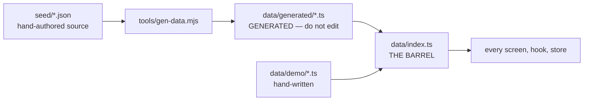

# Repository Map

**Audited commit:** `dbe6d45e7297c5d889be9e69c3e2e190a578e6b1` (branch `main`)
**Repository root:** the `Everest/` directory (this is the app root — `package.json`, `app.json` and `node_modules` all live here).

---

## 1. Top-level layout

```
Everest/
├── app/              43 files   Routes (expo-router). Thin wrappers.
├── features/         68 files   Screen implementations, by domain.
├── components/       70 files   Presentation: ui/ primitives + feature support.
├── core/             54 files   Pure domain logic. NO React. 18 test files.
├── services/         30 files   Platform boundary: device, network, storage.
├── store/             7 files   Global state — 6 Context providers + barrel.
├── hooks/            13 files   React glue.
├── data/             14 files   Runtime content (demo + generated).
├── seed/             20 files   Source content (JSON) → generated by tools/.
├── types/            12 files   TypeScript domain models.
├── theme/             8 files   Design tokens.
├── constants/         4 files   App identity, geo, storage keys.
├── utils/             4 files   Pure helpers.
├── shared/            3 files   Cross-cutting pure logic (geo, merit, types).
├── assets/           44 files   Images, audio, fonts, ONNX model.
├── supabase/          8 files   SQL migrations (remote schema).
├── tools/            16 files   Build/verify/generation scripts.
├── harvest/          12 files   Python imagery pipeline (offline, not shipped).
├── mock-api/          3 files   Zero-dep local API server.
├── landing/          15 files   Standalone Next.js download page.
├── plugins/           1 file    Custom Expo config plugin.
├── patches/           1 file    patch-package patch.
├── deck/              8 files   Presentation/demo material.
├── models/            1 file    Model README.
└── docs/ai-context/            This knowledge base.
```

---

## 2. Entry points

| Entry | File | Role |
|---|---|---|
| **Package main** | [index.tsx](../../index.tsx) (`package.json`) | Registers immediately, restores the colour theme, then mounts expo-router |
| **Root layout** | [app/_layout.tsx](../../app/_layout.tsx) | Providers, splash gate, sync + notification wiring |
| **Launch decision** | [app/index.tsx](../../app/index.tsx) | Redirect: onboarding vs main |
| **Provider composition** | [store/index.tsx](../../store/index.tsx) | `AppProviders` — the single mounting point |
| **Service registry** | [services/index.ts](../../services/index.ts) | Namespace re-exports of all services |

---

## 3. Application directories

### `app/` — routes (43 files)

File-based routing. **Thin wrappers only** — 3–6 lines each, reading params and rendering a feature screen.

| Path | Contents |
|---|---|
| `app/_layout.tsx` | Root Stack + providers + boot gate |
| `app/index.tsx` | Launch redirect |
| `app/onboarding/` | 5-step first-run stack + layout + redirect |
| `app/(main)/_layout.tsx` | Tabs navigator (3 surfaces + hidden settings) |
| `app/(main)/tirtha/` | 7 routes: index, map, site/[siteId], then-now/[siteId], quests × 3 |
| `app/(main)/sakshi/` | 8 routes: index, vantage, capture, observation, guardians, register × 2, then-now/[siteId] |
| `app/(main)/dhamma/` | 3 routes: index, question, reflect |
| `app/(main)/settings/` | 8 routes |

**Modify when:** adding/renaming a route or changing its params. Full table in [SCREENS_AND_NAVIGATION.md](SCREENS_AND_NAVIGATION.md).

### `features/` — screens (63 files)

Real screen implementations, one directory per domain, each with an `index.ts` barrel.

| Directory | Key exports | Notes |
|---|---|---|
| [features/tirtha/](../../features/tirtha/) | `TirthaScreen`, `LiveMapScreen`, `SiteDetailScreen`, `ThenNowScreen` + 7 sub-components | Largest feature. `ThenNowScreen` is mounted under **both** tirtha and sakshi routes |
| [features/sakshi/](../../features/sakshi/) | `SakshiScreen`, `VantageScreen`, `CaptureScreen`, `ObservationScreen` | The core capture loop |
| [features/quests/](../../features/quests/) | `QuestListScreen`, `QuestDetailScreen`, `QuestCompletedScreen` + `components/` | Routed under **tirtha** |
| [features/dhamma/](../../features/dhamma/) | `DhammaScreen`, `DhammaChatScreen`, `ReflectionScreen` | |
| [features/settings/](../../features/settings/) | 8 screens + `components/` | Routed under a hidden stack |
| [features/onboarding/](../../features/onboarding/) | 5 screens + `OnboardingFrame`, `AlignmentRehearsal`, `steps.ts` | `steps.ts` is the flow definition |
| [features/chaityavali/](../../features/chaityavali/) | `ChaityavaliScreen`, `SiteHistoryScreen`, `register.ts` | Routed under **sakshi** as "register" |
| [features/leaderboard/](../../features/leaderboard/) | `LeaderboardScreen` | Routed under **sakshi** as "guardians" |
| [features/practice/](../../features/practice/) | `index.ts` **only — no screen** | See §7 |

> **Folder name ≠ route location.** Four features are mounted under a different surface than their folder suggests.

### `components/` — presentation (68 files)

| Subfolder | Purpose |
|---|---|
| [components/ui/](../../components/ui/) | **Design system**: Badge, BottomSheet, Button, Card, Chip, Divider, Icon, MetaRow, ProgressIndicator, ProgressRing, Screen, Text |
| [components/common/](../../components/common/) | EmptyState, ErrorState, LoadingState, OfflineBanner, ScreenHeader, SettingsButton |
| [components/map/](../../components/map/) | SiteMap3D, MapWebView, SitePlan, mapHtml — **with `.web.tsx` variants** |
| [components/chat/](../../components/chat/) | ChatBubble, ChatComposer, ChatTranscript, SourceList |
| [components/observation/](../../components/observation/) | ConditionSheet, PathologySummaryCard, YoloVisionOverlay |
| [components/reticle/](../../components/reticle/) | Reticle, AlignmentReadout, CompassCalibrationPrompt |
| [components/site/](../../components/site/) | NarrationPlayer, SiteListItem, SiteVisual, VantageListItem |
| [components/source/](../../components/source/) | Citation, SourceCard, SourceDetailSheet |
| [components/thennow/](../../components/thennow/) | ThenNowCompare, EvidenceTierLabel |
| [components/monk/](../../components/monk/) | GreetingMonk, SpeechCloud ⚠️ **all 16 lint errors are here** |
| [components/navigation/](../../components/navigation/) | SurfaceTabBar — the custom tab bar |
| [components/practice/](../../components/practice/) | MeritAcknowledgement, PracticeSummaryCard |
| [components/arrival/](../../components/arrival/), [series/](../../components/series/), [timeline/](../../components/timeline/), [voice/](../../components/voice/) | ArrivalWisdom, TimeSeriesScrubber, Timeline, SpeakButton |

Every subfolder has an `index.ts` barrel; [components/index.ts](../../components/index.ts) aggregates.

### `core/` — domain logic (53 files, 18 tests)

**No React. No React Native.** Excluded from the app tsconfig; compiled and tested separately.

`adapters/`, `alignment/`, `chaityavali/`, `copy/`, `dana/`, `dhamma/`, `guide/`, `map/`, `merit/`, `net/`, `progression/`, `quests/`, `session/`, `story/`, `vision/`, `wisdom/`

See [core/INTEGRATION.md](../../core/INTEGRATION.md) for the project's own wiring notes.

### `services/` — platform boundary (30 files)

The **only** layer that touches device APIs or the network. All exported as namespaces from [services/index.ts](../../services/index.ts).

`ai/` (onnx, yoloEngine), `application/` (controlled reload), `arrival/`, `audio/`, `camera/`, `custodian/`, `database/`, `device/`, `dhamma/`, `geofencing/`, `guide/`, `integrity/`, `leaderboard/`, `location/` (+ demoWalk, watchTeardown), `net/`, `notifications/`, `offlineModel/`, `permissions/`, `questReview/`, `sensors/`, `storage/`, `supabase/` (auth, index, sync), `sync/`, `voice/`

**[services/database/index.ts](../../services/database/index.ts) is the largest file in the project (1047 lines)** — it holds the local SQLite migration list (versions 0–7) and all DB helpers.

### `store/`, `hooks/`, `types/`, `theme/`, `constants/`, `utils/`, `shared/`

| Directory | Contents |
|---|---|
| [store/](../../store/) | 6 providers: app-state, preferences, permissions, practice, quests, arrival + `index.tsx` |
| [hooks/](../../hooks/) | useAlignment, useCurrentPosition, useDemoWalk, useHaptics, useHeading, useKeyboardInset, useNarration, useNearbySites, useSceneBottomGap, useSiteArrival, useStoryProgress, useSync |
| [types/](../../types/) | condition, dhamma, heritage, permissions, practice, precinct, preferences, quests, source + `declarations.d.ts` |
| [theme/](../../theme/) | colors, fonts, layers, mapStyle, radii, spacing, typography |
| [constants/](../../constants/) | app (identity, surfaces), geo (Lumbini coords/radii), storage (**every persisted key**) |
| [utils/](../../utils/) | alignmentHint, format, geo — **pure functions only** |
| [shared/](../../shared/) | geo, merit, types — pure, excluded from app tsconfig alongside `core/` |

> `hooks/useUserPreferences.ts` is referenced by [PROJECT.md](../../PROJECT.md) but **does not exist**. Preferences come from `usePreferences()` in [store/preferences.tsx](../../store/preferences.tsx).

---

## 4. Content pipeline



### The barrel rule

[data/index.ts](../../data/index.ts) states it:

> "Data access lives behind this barrel so screens never import from `data/demo/*` directly. When real content arrives — LDT survey data, a synced catalogue — it is swapped in here and no screen changes."

**Verified true.** All 30 consumers import `from '@/data'`. **Zero** import `data/demo/*` or `data/generated/*` directly. Keep it that way.

### Generated files — never hand-edit

[data/generated/sites.ts](../../data/generated/sites.ts) and [quests.ts](../../data/generated/quests.ts) carry:

> "GENERATED by tools/gen-data.mjs from seed/. Do not edit by hand. Run `node tools/gen-data.mjs` after changing `seed/sites.json` or `seed/vantages.json`. **`npm run verify` fails if this file is stale.**"

**To change site or quest content: edit `seed/*.json`, then `npm run gen`, then `npm run verify`.**

### ⚠️ `data/demo/sites.ts` is dead code — and it is a trap

It is **not exported** by [data/demo/index.ts](../../data/demo/index.ts) and is imported by nothing. It survives on disk as a migration fallback.

[services/location/demoWalk.ts](../../services/location/demoWalk.ts) documents the hazard precisely:

> "The ids are the ones in `data/generated/sites.ts`, which is the list `@/data` actually exports. **`data/demo/sites.ts` still exists on disk with a *different* set of ids** (`ashoka-pillar`, `puskarini-pond`, `bodhi-tree`) and is no longer exported — an itinerary written against those names resolves nothing and **silently skips every leg**. If a waypoint here stops resolving, check which of the two files the name came from."

**If a site id resolves to nothing, this is the first thing to check.** Live ids come from `data/generated/sites.ts` (built from `seed/sites.json`).

### Seed content (`seed/` — 20 files)

`sites.json`, `vantages.json`, `quests.json`, `plates.json`, `narration.json`, `history.json`, `timeline.json`, `reflections.json`, `dhamma-modes.json`, `needs.json`, `now-images.json`, `prompts.json`, `vantages.candidates.json` + 4 markdown docs.

Validated by `npm run validate`: **12 sites, 6 vantages, 10 quests, 3 needs, 5 timeline, 10 plates**.

---

## 5. Tooling

| Script | Purpose | npm script |
|---|---|---|
| [tools/gen-data.mjs](../../tools/gen-data.mjs) | `seed/` → `data/generated/` | `gen` |
| [tools/validate-seed.mjs](../../tools/validate-seed.mjs) | Seed integrity | `validate` |
| [tools/lint-vocab.mjs](../../tools/lint-vocab.mjs) | Terminology/typography linter | `vocab` |
| [tools/run-tests.mjs](../../tools/run-tests.mjs) | Zero-install test runner over `core/` | `test` |
| [tools/dhamma-eval.mjs](../../tools/dhamma-eval.mjs) | Answer-grounding eval | `eval:dhamma` |
| [tools/fetch-bilara.mjs](../../tools/fetch-bilara.mjs) | Fetch Buddhist text corpus | `corpus:fetch` |
| [tools/seed-history.mjs](../../tools/seed-history.mjs) | Seed history content | — |
| [tools/run-dhamma-eval.mjs](../../tools/run-dhamma-eval.mjs) | *(second eval entry — **Needs verification**)* | — |
| [tools/build-greeting-monk.py](../../tools/build-greeting-monk.py), [extract-monk-frames.py](../../tools/extract-monk-frames.py) | Monk animation frames | — |
| [tools/make-narration-audio.ps1](../../tools/make-narration-audio.ps1) | Narration `.opus` generation | — |
| [tools/test/](../../tools/test/) | Vitest harness + `core/` typecheck config | — |

---

## 6. Non-application directories

| Directory | Status | Notes |
|---|---|---|
| [harvest/](../../harvest/) | **Not shipped** | Python imagery pipeline (Mukherji plates, Wikimedia, Mapillary). Own `requirements.txt` |
| [landing/](../../landing/) | **Separate app** | Standalone Next.js APK-download page. Own `package.json`, lockfile, `AGENTS.md`, `CLAUDE.md`. Excluded via `.easignore` |
| [mock-api/](../../mock-api/) | Dev/deploy | Zero-dep server + `railway.json` |
| [deck/](../../deck/) | Documentation | Demo script, QA prep, limitations, rehearsal checklist |
| [supabase/migrations/](../../supabase/migrations/) | **Schema source of truth** | 8 SQL files |
| [models/](../../models/) | Docs only | README |
| `.expo/` | **Generated** | Typed routes. Never commit or edit |

---

## 7. Dead, orphaned, and stale

| Item | Status | Evidence |
|---|---|---|
| [data/demo/sites.ts](../../data/demo/sites.ts) | **Dead code, active hazard** | Not barrel-exported; conflicting site ids. Documented in `demoWalk.ts` |
| [features/practice/](../../features/practice/) | **Barrel only, no screen** | Only `index.ts`. Merit UI lives in `components/practice/` and `store/practice.tsx` |
| [PROJECT.md](../../PROJECT.md) | **Stale** | References `hooks/useUserPreferences.ts` (absent) and screen names that no longer match (`SettingsHomeScreen`, `PermissionsSettingsScreen`, `StorageExportScreen`, `OfflineRetentionScreen`, `AboutLegalScreen`) |
| [tools/run-dhamma-eval.mjs](../../tools/run-dhamma-eval.mjs) | Uncertain | Duplicate-looking entry point; no npm script |
| `assets/fonts/`, `assets/models/` READMEs | Placeholders | Fonts come from `@expo-google-fonts` packages |

> **Zero `TODO`, `FIXME`, `HACK` or `XXX` markers** exist across `app/`, `features/`, `components/`, `hooks/`, `store/`, `services/`, `core/`, `shared/`, `utils/`, `types/`. Unusual and worth noting — incomplete work is not flagged inline, so absence of a TODO is not evidence of completeness.

---

## 8. Root documentation files

| File | Content | Trust |
|---|---|---|
| [README.md](../../README.md) | Purpose, three surfaces, five promises, run instructions | ✅ Verified accurate |
| [PROJECT.md](../../PROJECT.md) | Milestones M1–M3, feature inventory | ⚠️ **Stale symbol names** |
| [documentation.md](../../documentation.md) | 58 KB | Not audited |
| [handbook.md](../../handbook.md) | 156 KB | Not audited |
| [SAKSHI-COMPLETE.md](../../SAKSHI-COMPLETE.md) | **384 KB** | Not audited |
| [SAKSHI-PROJECT-STATUS.md](../../SAKSHI-PROJECT-STATUS.md) | 32 KB | Not audited |
| [explanation.md](../../explanation.md) | 34 KB | Not audited |
| [HANDOFF-PHASE-8-9.md](../../HANDOFF-PHASE-8-9.md) | 21 KB | Not audited |
| [TEST_INFRA.md](../../TEST_INFRA.md) | Test setup | Not cross-checked |
| [LICENCES.md](../../LICENCES.md) | 30 KB — asset/source licensing | Not audited |
| [slides.md](../../slides.md), [video-demo.md](../../video-demo.md) | Presentation | — |

> ~700 KB of prior prose documentation exists at root. It was **not** fully verified in this audit. Where it disagrees with `docs/ai-context/`, prefer this knowledge base — it is commit-stamped and evidence-cited — but verify against source before acting on either.

---

## 9. Where to make a change

| Change | Edit |
|---|---|
| Route added/renamed | `app/**` (+ `npx expo start -c`) |
| Screen behaviour | `features/<domain>/<Name>Screen.tsx` |
| Shared UI | `components/ui/*` — **wide blast radius** |
| Global state | `store/*` + `store/index.tsx` |
| Device/network access | `services/*` — never call `expo-*` from a screen |
| Business rule | `core/*` (+ its `.test.ts`) |
| Site/quest content | `seed/*.json` → `npm run gen` |
| Storage key | `constants/storage.ts` |
| Colour/spacing/font | `theme/*` |
| Permission string | `app.json` plugin config |
| Remote schema | **new** `supabase/migrations/00NN_*.sql` |
| Local schema | **append** to `migrations` in `services/database/index.ts` |
| Domain type | `types/*` |

---

*Part of the [docs/ai-context](README.md) knowledge base. Snapshot of commit `dbe6d45e`; verify against current source before relying on details.*
