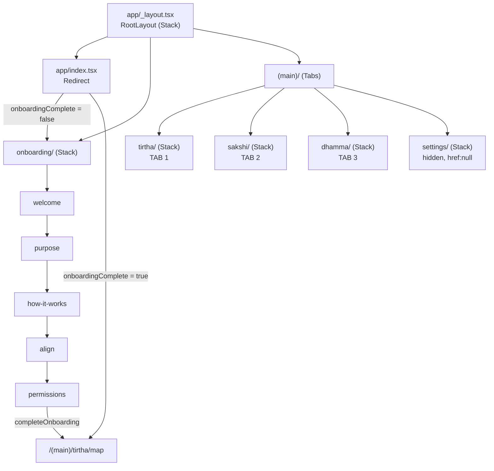

# Screens and Navigation

**Audited commit:** `dbe6d45e7297c5d889be9e69c3e2e190a578e6b1` (branch `main`)
**Router:** `expo-router` ~57.0.11, file-based, with `typedRoutes: true` and `tsconfigPaths: true` (`app.json` → `expo.experiments`).

---

## 1. How routing works in this project

Routing is **file-based**. Every file under `app/` becomes a route; the file path *is* the URL path. Groups in parentheses — `(main)` — organise files without adding a URL segment.

The project follows a strict **thin-route / fat-feature** split:

- Files under `app/` are **thin wrappers**. They read route params and render a screen component. Almost all are 3–6 lines.
- The real screen implementation lives in `features/<domain>/<Name>Screen.tsx` and is imported through the feature's barrel (`features/<domain>/index.ts`).

Example — [app/(main)/tirtha/site/[siteId].tsx](<../../app/(main)/tirtha/site/[siteId].tsx>):

```tsx
import { useLocalSearchParams } from 'expo-router';
import { SiteDetailScreen } from '@/features/tirtha';

export default function SiteRoute() {
  const { siteId } = useLocalSearchParams<{ siteId: string }>();
  return <SiteDetailScreen siteId={siteId} />;
}
```

**Implication for Codex:** to change *what a screen does*, edit the `features/` component. To change *what a route is called or which params it takes*, edit the `app/` file. Adding a route means adding a file under `app/` — there is no central route registry to update.

---

## 2. Navigation hierarchy

```
app/_layout.tsx  (RootLayout — Stack, headerShown:false, animation:'fade')
├── index.tsx                    → <Redirect> launch decision
├── onboarding/                  (Stack, animation:'slide_from_right')
│   ├── index.tsx                → <Redirect> to onboardingSteps[0].route
│   ├── welcome.tsx
│   ├── purpose.tsx
│   ├── how-it-works.tsx
│   ├── align.tsx
│   └── permissions.tsx
└── (main)/_layout.tsx           (Tabs from 'expo-router/js-tabs', custom SurfaceTabBar)
    ├── tirtha/     (Stack)      ← tab 1
    ├── sakshi/     (Stack)      ← tab 2
    ├── dhamma/     (Stack)      ← tab 3
    └── settings/   (Stack)      ← registered but hidden (href: null)
```

### The three-surface model

[app/(main)/_layout.tsx](<../../app/(main)/_layout.tsx>) is explicit that the app has exactly **three surfaces** — Tīrtha, Sākṣī, Dhamma — and that this is a deliberate design constraint, not an accident:

> "Tīrtha, Sākṣī and Dhamma — no Home, no Profile, no Settings. Each tab is a stack in its own right so detail routes (a site, a vantage, a question) push within their surface and keep the navigator visible."

**Settings is deliberately not a fourth tab.** It is registered as a `Tabs.Screen` with `options={{ href: null }}` so its routes resolve, but it never appears in the tab bar. It is reached from a header control on each surface. The source comment cites an internal rule "§51" for this. **Do not add a fourth tab without checking that constraint.**

Each surface is a `Stack`, so detail routes push *within* the surface and the tab bar stays visible.



---

## 3. Provider nesting order

Defined in [app/_layout.tsx](../../app/_layout.tsx) and [store/index.tsx](../../store/index.tsx). **Order matters** — inner providers may read outer ones.

```
GestureHandlerRootView          (react-native-gesture-handler)
└── SafeAreaProvider            (react-native-safe-area-context)
    └── AppProviders            (store/index.tsx)
        └── AppStateProvider        (store/app-state.tsx)
            └── PreferencesProvider (store/preferences.tsx)
                └── PermissionsProvider (store/permissions.tsx)
                    └── PracticeProvider  (store/practice.tsx)
                        └── QuestsProvider    (store/quests.tsx)
                            └── ArrivalProvider   (store/arrival.tsx)
                                └── RootNavigator  → <Stack>
```

`AppProviders` exists so the root layout composes one element instead of a nesting pyramid. **To add a global provider, edit [store/index.tsx](../../store/index.tsx), not the root layout.**

### Boot gate

`RootNavigator` renders `null` until **both** `fontsReady` (from `useAppFonts()`, [theme/fonts.ts](../../theme/fonts.ts)) and `hydrated` (from `useAppState()`) are true. The splash screen is held via `SplashScreen.preventAutoHideAsync()` at module scope and only hidden once both settle.

The source states the reason plainly: rendering early "would flash onboarding at returning users for a frame." **Do not render UI before this gate** — that is the bug it exists to prevent.

---

## 4. Launch decision (the only auth-like gate)

[app/index.tsx](../../app/index.tsx) is the entire launch decision:

```tsx
return <Redirect href={onboardingComplete ? '/(main)/tirtha/map' : '/onboarding'} />;
```

- First launch → `/onboarding`
- Otherwise → `/(main)/tirtha/map`

`onboardingComplete` is persisted via `storage.getBoolean(StorageKeys.onboardingComplete)` ([store/app-state.tsx](../../store/app-state.tsx)).

> **There is no user login gate on navigation.** No route redirects based on a signed-in user. The only gate is the first-run onboarding flag. Auth (if any) is handled at the data layer, not the navigation layer — see [BACKEND_AND_API.md](BACKEND_AND_API.md).

---

## 5. Route table

Auth column reflects *navigation* gating only. All `(main)` routes require `onboardingComplete = true` **indirectly** — a returning user lands there, but nothing blocks direct navigation.

### Root

| Route | Source file | Renders | Params | Notes |
|---|---|---|---|---|
| `/` | [app/index.tsx](../../app/index.tsx) | `<Redirect>` | — | Launch decision only |

### Onboarding (`/onboarding/*`)

Sequence is data-driven from [features/onboarding/steps.ts](../../features/onboarding/steps.ts) (`onboardingSteps`), not hardcoded pushes — so the flow can be reordered in one place and the progress indicator stays correct.

| Route | Source file | Renders | Step key |
|---|---|---|---|
| `/onboarding` | [app/onboarding/index.tsx](../../app/onboarding/index.tsx) | `<Redirect>` to `onboardingSteps[0].route` | — |
| `/onboarding/welcome` | [app/onboarding/welcome.tsx](../../app/onboarding/welcome.tsx) | `WelcomeScreen` | `welcome` (1/5) |
| `/onboarding/purpose` | [app/onboarding/purpose.tsx](../../app/onboarding/purpose.tsx) | `PurposeScreen` | `purpose` (2/5) |
| `/onboarding/how-it-works` | [app/onboarding/how-it-works.tsx](../../app/onboarding/how-it-works.tsx) | `HowItWorksScreen` | `how-it-works` (3/5) |
| `/onboarding/align` | [app/onboarding/align.tsx](../../app/onboarding/align.tsx) | `AlignScreen` | `align` (4/5) |
| `/onboarding/permissions` | [app/onboarding/permissions.tsx](../../app/onboarding/permissions.tsx) | `PermissionsScreen` (onboarding variant) | `permissions` (5/5) |

`steps.ts` exports `stepIndex(key)`, `nextRoute(key)` and `TOTAL_STEPS`. The `align` route is cast `as Href` with a comment noting Expo regenerates the typed route after `npx expo start -c`.

> **Name collision to watch:** there are two different `PermissionsScreen` components — [features/onboarding/PermissionsScreen.tsx](../../features/onboarding/PermissionsScreen.tsx) and [features/settings/PermissionsScreen.tsx](../../features/settings/PermissionsScreen.tsx). They are imported from different barrels. Check which one you are editing.

### Tīrtha surface (`/(main)/tirtha/*`) — tab 1

| Route | Source file | Renders (component file) | Params |
|---|---|---|---|
| `/(main)/tirtha` | [app/(main)/tirtha/index.tsx](<../../app/(main)/tirtha/index.tsx>) | `TirthaScreen` ([features/tirtha/TirthaScreen.tsx](../../features/tirtha/TirthaScreen.tsx)) | — |
| `/(main)/tirtha/map` | [app/(main)/tirtha/map.tsx](<../../app/(main)/tirtha/map.tsx>) | `LiveMapScreen` ([features/tirtha/LiveMapScreen.tsx](../../features/tirtha/LiveMapScreen.tsx)) | — |
| `/(main)/tirtha/site/[siteId]` | [app/(main)/tirtha/site/[siteId].tsx](<../../app/(main)/tirtha/site/[siteId].tsx>) | `SiteDetailScreen` ([features/tirtha/SiteDetailScreen.tsx](../../features/tirtha/SiteDetailScreen.tsx)) | `siteId: string` |
| `/(main)/tirtha/then-now/[siteId]` | [app/(main)/tirtha/then-now/[siteId].tsx](<../../app/(main)/tirtha/then-now/[siteId].tsx>) | `ThenNowScreen` ([features/tirtha/ThenNowScreen.tsx](../../features/tirtha/ThenNowScreen.tsx)) | `siteId: string` |
| `/(main)/tirtha/quests` | [app/(main)/tirtha/quests/index.tsx](<../../app/(main)/tirtha/quests/index.tsx>) | `QuestListScreen` ([features/quests/QuestListScreen.tsx](../../features/quests/QuestListScreen.tsx)) | — |
| `/(main)/tirtha/quests/[questId]` | [app/(main)/tirtha/quests/[questId].tsx](<../../app/(main)/tirtha/quests/[questId].tsx>) | `QuestDetailScreen` ([features/quests/QuestDetailScreen.tsx](../../features/quests/QuestDetailScreen.tsx)) | `questId: string` (defaulted `?? ''`) |
| `/(main)/tirtha/quests/completed/[questId]` | [app/(main)/tirtha/quests/completed/[questId].tsx](<../../app/(main)/tirtha/quests/completed/[questId].tsx>) | `QuestCompletedScreen` ([features/quests/QuestCompletedScreen.tsx](../../features/quests/QuestCompletedScreen.tsx)) | `questId: string` (defaulted `?? ''`) |

> **`/(main)/tirtha` vs `/(main)/tirtha/map`:** the launch redirect goes to `/map`, not the tab index. Both routes exist and render different components (`TirthaScreen` vs `LiveMapScreen`). Which one the tab button activates — and whether `TirthaScreen` is reachable in normal use — **Needs verification** (see [KNOWN_ISSUES_AND_TECHNICAL_DEBT.md](KNOWN_ISSUES_AND_TECHNICAL_DEBT.md)).

### Sākṣī surface (`/(main)/sakshi/*`) — tab 2

| Route | Source file | Renders (component file) | Params |
|---|---|---|---|
| `/(main)/sakshi` | [app/(main)/sakshi/index.tsx](<../../app/(main)/sakshi/index.tsx>) | `SakshiScreen` ([features/sakshi/SakshiScreen.tsx](../../features/sakshi/SakshiScreen.tsx)) | — |
| `/(main)/sakshi/vantage` | [app/(main)/sakshi/vantage.tsx](<../../app/(main)/sakshi/vantage.tsx>) | `VantageScreen` ([features/sakshi/VantageScreen.tsx](../../features/sakshi/VantageScreen.tsx)) | `vantageId: string` (query param) |
| `/(main)/sakshi/capture` | [app/(main)/sakshi/capture.tsx](<../../app/(main)/sakshi/capture.tsx>) | `CaptureScreen` ([features/sakshi/CaptureScreen.tsx](../../features/sakshi/CaptureScreen.tsx)) | `vantageId: string` (query param) |
| `/(main)/sakshi/observation` | [app/(main)/sakshi/observation.tsx](<../../app/(main)/sakshi/observation.tsx>) | `ObservationScreen` ([features/sakshi/ObservationScreen.tsx](../../features/sakshi/ObservationScreen.tsx)) | `observationId: string` (query param) |
| `/(main)/sakshi/guardians` | [app/(main)/sakshi/guardians.tsx](<../../app/(main)/sakshi/guardians.tsx>) | `LeaderboardScreen` ([features/leaderboard/LeaderboardScreen.tsx](../../features/leaderboard/LeaderboardScreen.tsx)) | — |
| `/(main)/sakshi/register` | [app/(main)/sakshi/register/index.tsx](<../../app/(main)/sakshi/register/index.tsx>) | `ChaityavaliScreen` ([features/chaityavali/ChaityavaliScreen.tsx](../../features/chaityavali/ChaityavaliScreen.tsx)) | — |
| `/(main)/sakshi/register/[siteId]` | [app/(main)/sakshi/register/[siteId].tsx](<../../app/(main)/sakshi/register/[siteId].tsx>) | `SiteHistoryScreen` ([features/chaityavali/SiteHistoryScreen.tsx](../../features/chaityavali/SiteHistoryScreen.tsx)) | `siteId: string` |
| `/(main)/sakshi/then-now/[siteId]` | [app/(main)/sakshi/then-now/[siteId].tsx](<../../app/(main)/sakshi/then-now/[siteId].tsx>) | `ThenNowScreen` ([features/tirtha/ThenNowScreen.tsx](../../features/tirtha/ThenNowScreen.tsx)) | `siteId: string` |

> **Cross-surface reuse:** `ThenNowScreen` (owned by `features/tirtha/`) is mounted at **two** routes — one under `tirtha/`, one under `sakshi/`. `LeaderboardScreen` (owned by `features/leaderboard/`) is mounted under `sakshi/` as "guardians", and `ChaityavaliScreen`/`SiteHistoryScreen` (owned by `features/chaityavali/`) are mounted under `sakshi/` as "register". **Folder name ≠ route location.** Editing `ThenNowScreen` affects both surfaces.

### Dhamma surface (`/(main)/dhamma/*`) — tab 3

| Route | Source file | Renders (component file) | Params |
|---|---|---|---|
| `/(main)/dhamma` | [app/(main)/dhamma/index.tsx](<../../app/(main)/dhamma/index.tsx>) | `DhammaScreen` ([features/dhamma/DhammaScreen.tsx](../../features/dhamma/DhammaScreen.tsx)) | — |
| `/(main)/dhamma/question` | [app/(main)/dhamma/question.tsx](<../../app/(main)/dhamma/question.tsx>) | `DhammaChatScreen` ([features/dhamma/DhammaChatScreen.tsx](../../features/dhamma/DhammaChatScreen.tsx)) | `questionId?: string`, `q?: string` — **both optional** |
| `/(main)/dhamma/reflect` | [app/(main)/dhamma/reflect.tsx](<../../app/(main)/dhamma/reflect.tsx>) | `ReflectionScreen` ([features/dhamma/ReflectionScreen.tsx](../../features/dhamma/ReflectionScreen.tsx)) | `siteId?: string` — **optional** |

Note the route file maps the URL param `q` to the component prop `query`.

### Settings (`/(main)/settings/*`) — hidden stack

| Route | Source file | Renders (component file) |
|---|---|---|
| `/(main)/settings` | [app/(main)/settings/index.tsx](<../../app/(main)/settings/index.tsx>) | `SettingsScreen` ([features/settings/SettingsScreen.tsx](../../features/settings/SettingsScreen.tsx)) |
| `/(main)/settings/about` | [app/(main)/settings/about.tsx](<../../app/(main)/settings/about.tsx>) | `AboutScreen` ([features/settings/AboutScreen.tsx](../../features/settings/AboutScreen.tsx)) |
| `/(main)/settings/arrivals` | [app/(main)/settings/arrivals.tsx](<../../app/(main)/settings/arrivals.tsx>) | `ArrivalsScreen` ([features/settings/ArrivalsScreen.tsx](../../features/settings/ArrivalsScreen.tsx)) |
| `/(main)/settings/offline-ai` | [app/(main)/settings/offline-ai.tsx](<../../app/(main)/settings/offline-ai.tsx>) | `OfflineAIScreen` ([features/settings/OfflineAIScreen.tsx](../../features/settings/OfflineAIScreen.tsx)) |
| `/(main)/settings/permissions` | [app/(main)/settings/permissions.tsx](<../../app/(main)/settings/permissions.tsx>) | `PermissionsScreen` ([features/settings/PermissionsScreen.tsx](../../features/settings/PermissionsScreen.tsx)) |
| `/(main)/settings/preferences` | [app/(main)/settings/preferences.tsx](<../../app/(main)/settings/preferences.tsx>) | `PreferencesScreen` ([features/settings/PreferencesScreen.tsx](../../features/settings/PreferencesScreen.tsx)) |
| `/(main)/settings/storage` | [app/(main)/settings/storage.tsx](<../../app/(main)/settings/storage.tsx>) | `StorageScreen` ([features/settings/StorageScreen.tsx](../../features/settings/StorageScreen.tsx)) |
| `/(main)/settings/sync` | [app/(main)/settings/sync.tsx](<../../app/(main)/settings/sync.tsx>) | `SyncScreen` ([features/settings/SyncScreen.tsx](../../features/settings/SyncScreen.tsx)) |

**Route count:** 33 routes across 40 `.tsx` files under `app/` (7 are `_layout.tsx` navigators).

---

## 6. Components that are NOT routes

These live in `features/` next to screens but are **sub-components mounted inside a screen**, not routes. Do not add route files for them:

- [features/tirtha/DemoWalkPanel.tsx](../../features/tirtha/DemoWalkPanel.tsx), [PlacePicker.tsx](../../features/tirtha/PlacePicker.tsx), [QuestHud.tsx](../../features/tirtha/QuestHud.tsx), [QuestSheet.tsx](../../features/tirtha/QuestSheet.tsx) — all mounted within `LiveMapScreen`.
- [features/tirtha/AskThisPlace.tsx](../../features/tirtha/AskThisPlace.tsx), [BuddhaChat.tsx](../../features/tirtha/BuddhaChat.tsx), [StorySequence.tsx](../../features/tirtha/StorySequence.tsx) — mounted within Tīrtha screens (**exact host screen: Needs verification**).
- [features/onboarding/OnboardingFrame.tsx](../../features/onboarding/OnboardingFrame.tsx) — shared chrome wrapper for onboarding steps.
- [features/onboarding/AlignmentRehearsal.tsx](../../features/onboarding/AlignmentRehearsal.tsx) — mounted within `AlignScreen`.
- All of [features/quests/components/](../../features/quests/components/) and [features/settings/components/](../../features/settings/components/).

---

## 7. Deep links and notification routing

**Scheme:** `sakshi` (`app.json` → `expo.scheme`). Deep linking is otherwise handled implicitly by expo-router's file-based URL mapping — there is no hand-written linking config object.

**Notification → route:** [app/_layout.tsx](../../app/_layout.tsx) subscribes to arrival-banner taps and routes them:

```tsx
notifications.subscribeToArrivalTaps((target) => {
  if (target.kind === 'site') router.push(`/(main)/tirtha/site/${target.id}`);
  else router.push('/(main)/tirtha/map');
});
```

The source explains the placement and the behaviour it fixes: it is wired in the root layout because that is "the shallowest component with a router," and previously the banner "said a place had something to read and then dropped you wherever the app happened to be." A `site` target opens that site's page; a `precinct` target — which names no single monument — opens the map instead.

**This is the only programmatic deep-link-style routing in the app.** If you change the `site` route path, update this callback too.

---

## 8. Lifecycle side effects in the root layout

[app/_layout.tsx](../../app/_layout.tsx) attaches an `AppState` listener that fires `syncPendingObservations()` ([services/sync](../../services/sync/index.ts)) whenever the app returns to `active`. Errors are swallowed (`.catch(() => undefined)`).

**Implication:** background→foreground is a sync trigger. If you change the sync entry point, this is one of its call sites.

---

## 9. Back-navigation assumptions

- Each surface is an independent `Stack`, so back within a surface pops that surface's stack and keeps the tab bar visible.
- Onboarding uses `animation: 'slide_from_right'` specifically so "back should undo one step, and the gesture should feel like turning back a page, not scrubbing a carousel."
- Android predictive back is **disabled**: `"predictiveBackGestureEnabled": false` in `app.json`.
- Root stack uses `animation: 'fade'`.

---

## Needs verification

1. Whether `/(main)/tirtha` (`TirthaScreen`) is reachable in normal use, given the launch redirect targets `/(main)/tirtha/map`.
2. Which component the Tīrtha tab button activates (index vs map) — depends on `SurfaceTabBar` implementation in [components/navigation/SurfaceTabBar.tsx](../../components/navigation/SurfaceTabBar.tsx).
3. Exact host screens for `AskThisPlace`, `BuddhaChat`, `StorySequence`.
4. Per-screen loading/empty/error state coverage — not yet audited screen by screen.
5. Whether any screen validates `siteId`/`questId` params against a known list, and what renders when the id is unknown.

---

*Part of the [docs/ai-context](README.md) knowledge base. Snapshot of commit `dbe6d45e`; verify against current source before relying on details.*
