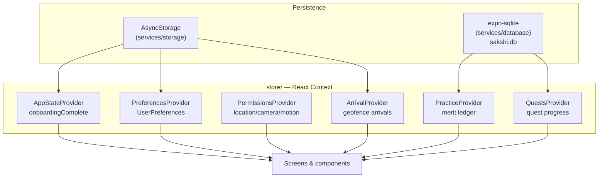

# State and Data Flow

**Audited commit:** `dbe6d45e7297c5d889be9e69c3e2e190a578e6b1` (branch `main`)

---

## 1. The state solution: React Context, no external library

There is **no Redux, Zustand, Jotai, MobX, or React Query** in this project. Verify in [package.json](../../package.json) — none are listed.

Global state is **six React Context providers**, each a plain `createContext` + `useState`/`useCallback`/`useMemo` module under [store/](../../store/). Server state is not cached by a library; it is fetched by service modules and held in whichever store or screen needs it.

Every store follows the same shape:

```tsx
const XContext = createContext<XContextValue | null>(null);

export function XProvider({ children }: { children: ReactNode }) { ... }

export function useX(): XContextValue {
  const ctx = useContext(XContext);
  if (!ctx) throw new Error('useX must be used within a XProvider');
  return ctx;
}
```

**The null-check-and-throw pattern is universal.** Keep it when adding a store — it turns a missing provider into a clear error instead of an undefined-property crash.

---

## 2. Provider composition

All six are composed in one place — [store/index.tsx](../../store/index.tsx) — exported as `AppProviders`, which the root layout mounts as a single element. The source explains why: "so the root layout composes one element instead of a nesting pyramid that grows with every new provider."

```
AppStateProvider          ← outermost
└── PreferencesProvider
    └── PermissionsProvider
        └── PracticeProvider
            └── QuestsProvider
                └── ArrivalProvider   ← innermost
```

**To add a global provider, edit [store/index.tsx](../../store/index.tsx)** — both the `AppProviders` tree and the re-export block at the top of that file. Do not add it to [app/_layout.tsx](../../app/_layout.tsx).



---

## 3. Store-by-store breakdown

### 3.1 `AppStateProvider` — [store/app-state.tsx](../../store/app-state.tsx)

The smallest and most load-bearing store: it answers *has this person been through onboarding?* before the first route renders.

| Field | Type | Meaning |
|---|---|---|
| `hydrated` | `boolean` | False until the stored flag has been read back from disk |
| `onboardingComplete` | `boolean` | Whether first-run is done |
| `completeOnboarding` | `() => Promise<void>` | Marks onboarding done, persists |
| `resetOnboarding` | `() => Promise<void>` | Development affordance — send yourself back through first-run |

**Persistence:** `StorageKeys.onboardingComplete` via `storage.getBoolean` / `storage.setBoolean`.

**`hydrated` is the important field.** The source is explicit: routing on `onboardingComplete` before the value has been read back "would flash onboarding at every returning user, so the root layout waits on `hydrated` instead of guessing." [app/_layout.tsx](../../app/_layout.tsx) renders `null` until it is true.

**Write-then-persist ordering:** `completeOnboarding` sets state *first*, then awaits the disk write — "navigation should not wait on a disk write."

### 3.2 `PreferencesProvider` — [store/preferences.tsx](../../store/preferences.tsx)

| Field | Type | Meaning |
|---|---|---|
| `hydrated` | `boolean` | False until the first read comes back |
| `preferences` | `UserPreferences` | The full preference object (defaults: `DEFAULT_USER_PREFERENCES` from [types/preferences.ts](../../types/preferences.ts)) |
| `update` | `<K extends keyof UserPreferences>(field: K, value: UserPreferences[K]) => Promise<void>` | Type-safe single-field update |
| `reset` | `() => Promise<void>` | Restore all defaults |

**Why a provider and not a local hook** (from the source): `alignmentTolerance` is read by the reticle, `distanceUnit` by every site list, `scriptPreference` by anything that prints a name. Per-consumer state would give each its own copy, "and changing a setting would update the settings screen and nothing else."

**One key per preference, not a serialised blob.** [constants/storage.ts](../../constants/storage.ts) documents the reasoning: a value added later "reads as absent and falls back to its default, instead of failing to parse an older shape and losing every setting at once."

`colorTheme` is persisted through the same provider. It is applied at
package-entry time, before route modules create static styles; changing it
therefore persists the new value and reloads the current app bundle.

**Error policy:** the storage layer swallows errors by design, so `update` has no rollback path — "the worst case is a preference that does not survive a restart."

### 3.3 `PermissionsProvider` — [store/permissions.tsx](../../store/permissions.tsx)

Tracks three permission kinds: **`location`, `camera`, `motion`**.

| Field | Type | Meaning |
|---|---|---|
| `hydrated` | `boolean` | Initial statuses read |
| `states` | `PermissionMap` | Per-kind `{ status, canAskAgain }` |
| `request` | `(kind: PermissionKind) => Promise<PermissionState>` | Prompt for one permission |
| `refresh` | `(kind?: PermissionKind) => Promise<void>` | Re-read status (all, or one) |
| `openSettings` | `() => Promise<void>` | Deep-link to OS settings for permanently-denied |

Initial state per kind is `{ status: 'undetermined', canAskAgain: true }`.

`usePermission(kind)` is a narrowed accessor "for a screen that cares about exactly one permission."

**`canAskAgain: false` is the permanently-denied signal** — that is what `openSettings()` exists for. See [NATIVE_AND_PERMISSIONS.md](NATIVE_AND_PERMISSIONS.md).

### 3.4 `PracticeProvider` — [store/practice.tsx](../../store/practice.tsx)

The **merit ledger** — the app's record of acts of attention.

| Field | Type | Meaning |
|---|---|---|
| `hydrated` | `boolean` | Ledger loaded |
| `summary` | `PracticeSummary` | Defaults `{ todayMerit: 0, dayComplete: false, balance: 0, sitesWitnessed: 0 }` |
| `events` | `MeritEvent[]` | The ledger entries |
| `recognise` | `(input: { kind: MeritKind; siteId?: string; observationId?: string }) => Promise<MeritEvent \| null>` | Record an act; returns `null` when not credited (e.g. daily cap) |
| `refresh` | `() => Promise<void>` | Reload from storage |

**Merit kinds** (with their user-facing acknowledgement copy, defined in this file):

| Kind | Acknowledgement text |
|---|---|
| `witness` | "A frame recorded from a fixed point. The series is one longer." |
| `observation` | "What you saw is now part of the record." |
| `resurvey` | "You returned. That is what makes the series worth having." |
| `study` | "Read through to the sources." |
| `reflection` | "Sat with the question." |
| `wisdom` | "Lumbini Wisdom received. Merit has been acknowledged." |

**`recognise` returning `null` is a normal outcome, not an error** — the rules in [core/merit/cap.ts](../../core/merit/cap.ts) and [core/merit/rules.ts](../../core/merit/rules.ts) can decline to credit. Handle the null.

The ledger is **append-only**. [constants/storage.ts](../../constants/storage.ts) contrasts it with `storiesRead`, which is deliberately kept *out* of the ledger because it is "interface state … and re-reading one is not a second act worth recording."

### 3.5 `QuestsProvider` — [store/quests.tsx](../../store/quests.tsx)

The largest store (256 lines).

| Field | Type | Meaning |
|---|---|---|
| `hydrated` | `boolean` | Progress loaded |
| `quests` | `QuestWithProgress[]` | All quests, each joined with its progress |
| `inProgressQuests` | `QuestWithProgress[]` | Derived filter |
| `availableQuests` | `QuestWithProgress[]` | Derived filter |
| `completedQuests` | `QuestWithProgress[]` | Derived filter |
| `getQuestById` | `(questId: string) => QuestWithProgress \| undefined` | **Returns undefined for unknown ids** |
| `startQuest` | `(questId: string) => Promise<void>` | Begin a quest |
| `completeTask` | `(questId, taskId) => Promise<TaskCompletionResult>` | Complete one task |
| `uncompleteTask` | `(questId, taskId) => Promise<void>` | Undo |
| `creditConditionReport` | `(siteId: string) => Promise<number>` | Credit a condition report against quests |
| `resetQuests` | `() => Promise<void>` | Wipe progress |
| `refresh` | `() => Promise<void>` | Reload |

`TaskCompletionResult` = `{ progress: QuestProgress; questCompleted: boolean; rewardGranted: boolean }` — the caller uses `questCompleted` to route to the completion screen and `rewardGranted` to show a reward.

**`getQuestById` returns `undefined`** — quest detail screens receive `questId` from the URL (defaulted to `''`), so every consumer must handle the not-found case.

### 3.6 `ArrivalProvider` — [store/arrival.tsx](../../store/arrival.tsx)

Geofenced arrival notifications for **precincts** (areas), distinct from sites (single monuments).

| Field | Type | Meaning |
|---|---|---|
| `hydrated` | `boolean` | Loaded |
| `status` | `ArrivalStatus` | Union type — see source for the full set |
| `problem` | `string?` | Why arrivals are unavailable, when applicable |
| `precincts` | `Precinct[]` | Known precincts |
| `lastArrival` | `{ precinctId: string; at: string } \| null` | Most recent arrival |
| `enable` / `disable` | `() => Promise<void>` | Toggle geofencing |
| `simulateArrival` | `(precinctId: string) => Promise<boolean>` | **Demo/testing affordance** |
| `clearLastArrival` | `() => void` | Dismiss |

**De-duplication:** `StorageKeys.arrivalsLastNotified` stores a JSON map of precinct id → ISO timestamp. Without it, "walking the boundary of the Sacred Garden re-notifies on every crossing."

`simulateArrival` exists so arrivals can be demonstrated without physically walking into a geofence — relevant to demo/testing, see [TESTING_AND_QUALITY.md](TESTING_AND_QUALITY.md).

---

## 4. Persistence layers

Two distinct mechanisms:

| Layer | Module | Backing | Used for |
|---|---|---|---|
| Key–value | [services/storage/index.ts](../../services/storage/index.ts) | `@react-native-async-storage/async-storage` | Flags, preferences, small JSON maps |
| Relational | [services/database/index.ts](../../services/database/index.ts) | `expo-sqlite`, db name `sakshi.db` | Observations, merit ledger, quest progress *(exact tables: **Needs verification**)* |

### AsyncStorage keys — complete list

All keys are centralised in [constants/storage.ts](../../constants/storage.ts) under `StorageKeys`. **Never inline a raw key string** — add it there. Prefix is `sakshi.v1`, "versioned so a breaking shape change can be migrated rather than guessed at."

| Constant | Key | Holds |
|---|---|---|
| `onboardingComplete` | `sakshi.v1.onboarding.complete` | boolean |
| `onboardingStage` | `sakshi.v1.onboarding.stage` | current step |
| `permissionPrimerSeen` | `sakshi.v1.permissions.primerSeen` | boolean |
| `prefColorTheme` | `sakshi.v1.preferences.colorTheme` | `'navy' \| 'white'` preference |
| `prefAlignmentTolerance` | `sakshi.v1.preferences.alignmentTolerance` | preference |
| `prefHapticsEnabled` | `sakshi.v1.preferences.hapticsEnabled` | preference |
| `prefAutoCapture` | `sakshi.v1.preferences.autoCapture` | preference |
| `prefScriptPreference` | `sakshi.v1.preferences.scriptPreference` | preference |
| `prefDistanceUnit` | `sakshi.v1.preferences.distanceUnit` | preference |
| `prefOfflineSyncMode` | `sakshi.v1.preferences.offlineSyncMode` | preference |
| `prefPhotoQuality` | `sakshi.v1.preferences.photoQuality` | preference |
| `prefWisdomTier` | `sakshi.v1.preferences.wisdomTier` | preference |
| `prefAutoWisdom` | `sakshi.v1.preferences.autoWisdom` | preference |
| `prefAutoNarration` | `sakshi.v1.preferences.autoNarration` | preference |
| `storiesRead` | `sakshi.v1.tirtha.storiesRead` | JSON map: site id → ISO timestamp |
| `arrivalsLastNotified` | `sakshi.v1.arrivals.lastNotified` | JSON map: precinct id → ISO timestamp |
| `deviceId` | `sakshi.device.id` | **no version prefix — deliberate** |

**The `deviceId` exception is intentional and must be preserved.** From the source: the prefix exists so a breaking change to a stored *shape* can be migrated; this value "has no shape, and its single useful property is that it never changes. Bumping the prefix would silently re-identify every install and break the grouping the id exists for."

`PreferenceKeys` maps each preference field name → its storage key; the settings screen iterates it.

`DATABASE_NAME = 'sakshi.db'` is also exported from this file.

---

## 5. The `core/` domain layer

[core/](../../core/) holds **framework-independent business logic** — no React, no React Native imports. Per the comment in [tsconfig.json](../../tsconfig.json), `core/` and `shared/` "are device-independent logic with their own typecheck config (`tools/test/tsconfig.json`); they use `.ts`-extension imports and `node:test`, so they are excluded from the app's own include glob."

This is why `core/` and `shared/` are in the app tsconfig's `exclude` list, and why `allowImportingTsExtensions` is enabled — so app code can still follow `import ... from '@/core'`.

| Module | Responsibility |
|---|---|
| [core/alignment/](../../core/alignment/) | Scoring how well the device is aligned to a fixed viewpoint |
| [core/chaityavali/](../../core/chaityavali/) | The site register |
| [core/dana/](../../core/dana/) | Allocation logic (giving/donation) |
| [core/dhamma/](../../core/dhamma/) | Q&A: corpus, retrieval, engine, LLM synthesis, reflection, eval |
| [core/guide/](../../core/guide/) | Guidance logic |
| [core/map/](../../core/map/) | Geofencing, pradakshina (circumambulation) |
| [core/merit/](../../core/merit/) | Merit ledger, rules, daily cap |
| [core/net/](../../core/net/) | Circuit breaker |
| [core/progression/](../../core/progression/) | Progression logic |
| [core/quests/](../../core/quests/) | Quest registry, reports, riddles, stillness |
| [core/session/](../../core/session/) | Close ritual, notification scheduling |
| [core/story/](../../core/story/) | Story sequences |
| [core/vision/](../../core/vision/) | On-device damage detection: candidate, detect, letterbox, yolo |
| [core/wisdom/](../../core/wisdom/) | Wisdom content selection |
| [core/copy/](../../core/copy/) | Failure-line copy strings |
| [core/adapters/](../../core/adapters/) | Coordinate adapters |

**Dependency direction:** `app/` → `features/` → `components/` + `hooks/` + `store/` → `services/` → `core/`. Core never imports upward. Keep it that way — its tests run under a separate, React-free tsconfig.

See [core/INTEGRATION.md](../../core/INTEGRATION.md) for the project's own notes on wiring core into screens.

---

## 6. Data flow patterns

### Write-then-persist (universal)

Both `AppStateProvider.completeOnboarding` and `PreferencesProvider.update` set React state **before** awaiting the disk write. Rationale in-source: a control that waits on AsyncStorage before moving "reads as a broken control."

### Hydration gating

Every store exposes `hydrated`. The root layout gates the whole app on `useAppState().hydrated`; individual screens should gate on their own store's `hydrated` before rendering values that would otherwise show defaults.

### Foreground sync trigger

[app/_layout.tsx](../../app/_layout.tsx) fires `syncPendingObservations()` on every `AppState` transition to `active`. Errors are swallowed.

### Service namespace imports

[services/index.ts](../../services/index.ts) re-exports every service as a **namespace**: `export * as storage from './storage'`. Consumers write `import { storage, notifications } from '@/services'` then `storage.getBoolean(...)`. Follow this convention for new services.

Note the lint-vocab exemption comment on the `leaderboard` export — the project runs a vocabulary linter (`npm run vocab`, [tools/lint-vocab.mjs](../../tools/lint-vocab.mjs)) over its own terminology, and `leaderboard` is explicitly allow-listed "by team decision."

---

## 7. State reset behaviour

There is **no global logout or account reset**. Individual resets exist:

- `resetOnboarding()` — [store/app-state.tsx](../../store/app-state.tsx), described in-source as a development affordance
- `reset()` on preferences — [store/preferences.tsx](../../store/preferences.tsx)
- `resetQuests()` — [store/quests.tsx](../../store/quests.tsx)
- Storage management UI — [features/settings/StorageScreen.tsx](../../features/settings/StorageScreen.tsx) *(exact capability: **Needs verification**)*

The merit ledger has **no reset action** in its context value — consistent with being append-only.

---

## Needs verification

1. Exact SQLite schema created by [services/database/index.ts](../../services/database/index.ts) — table names, columns, migrations.
2. Whether `PracticeProvider` and `QuestsProvider` persist to SQLite, AsyncStorage, or both.
3. Full `ArrivalStatus` union members and what drives each transition.
4. Whether any store holds duplicated state also owned by a service (potential source-of-truth ambiguity).
5. The complete `UserPreferences` shape and `DEFAULT_USER_PREFERENCES` values — see [types/preferences.ts](../../types/preferences.ts).

---

*Part of the [docs/ai-context](README.md) knowledge base. Snapshot of commit `dbe6d45e`; verify against current source before relying on details.*
